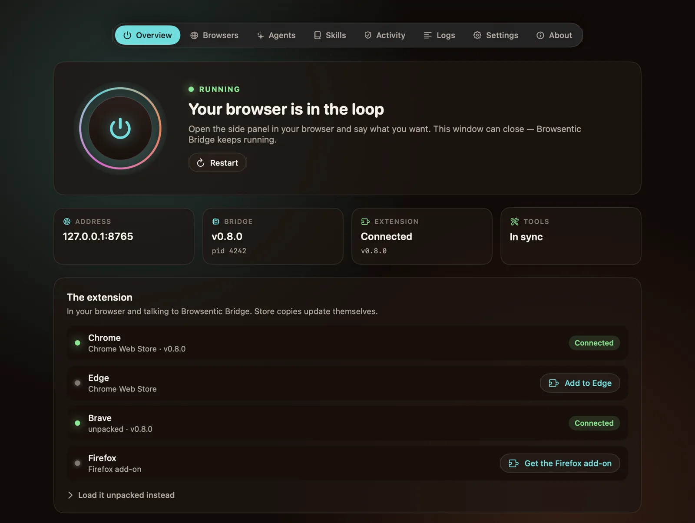
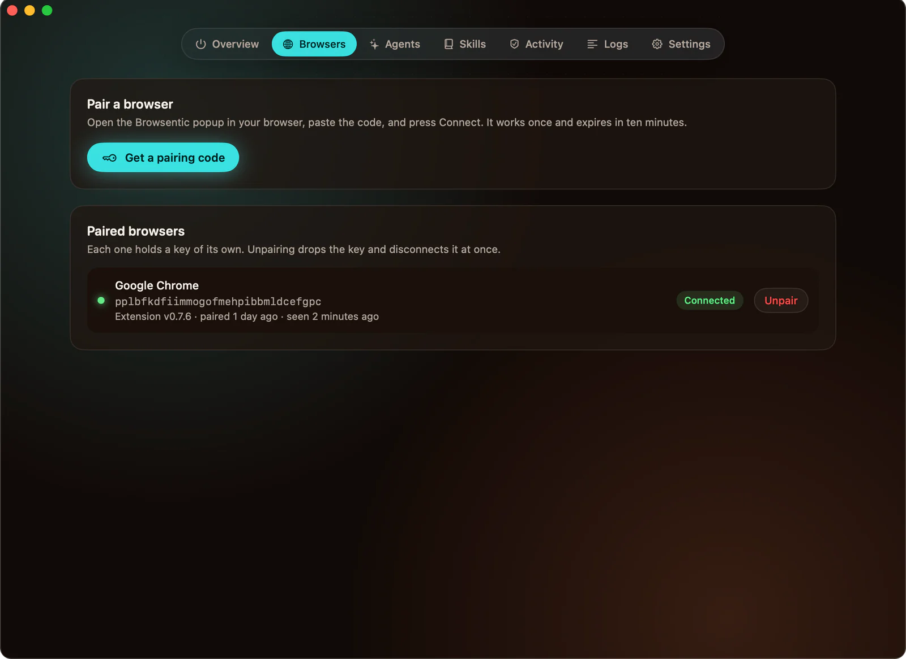
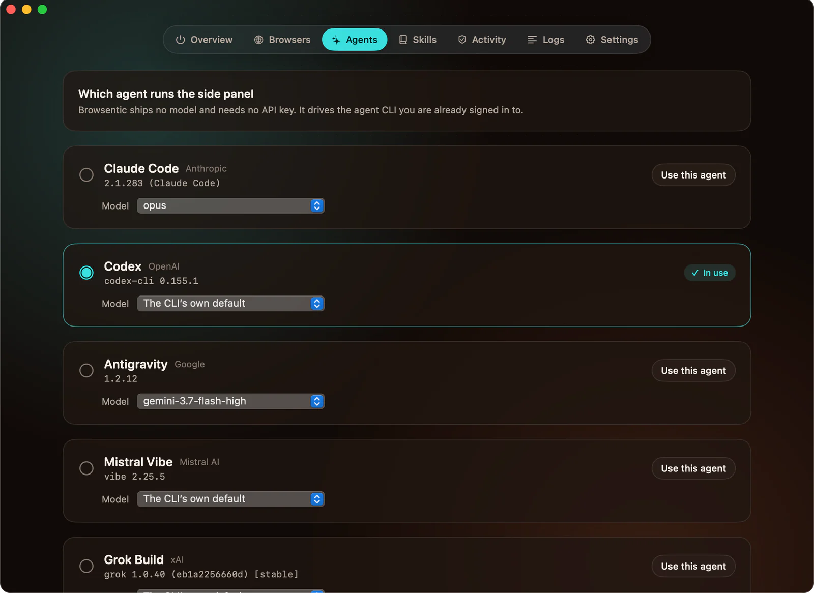
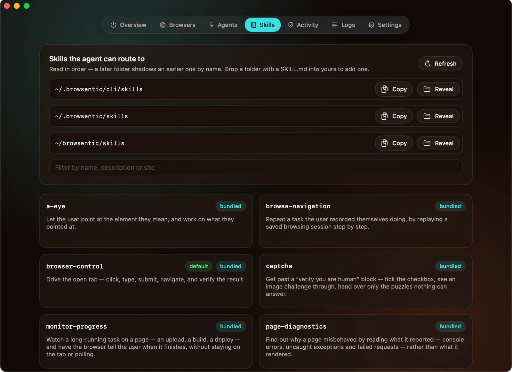
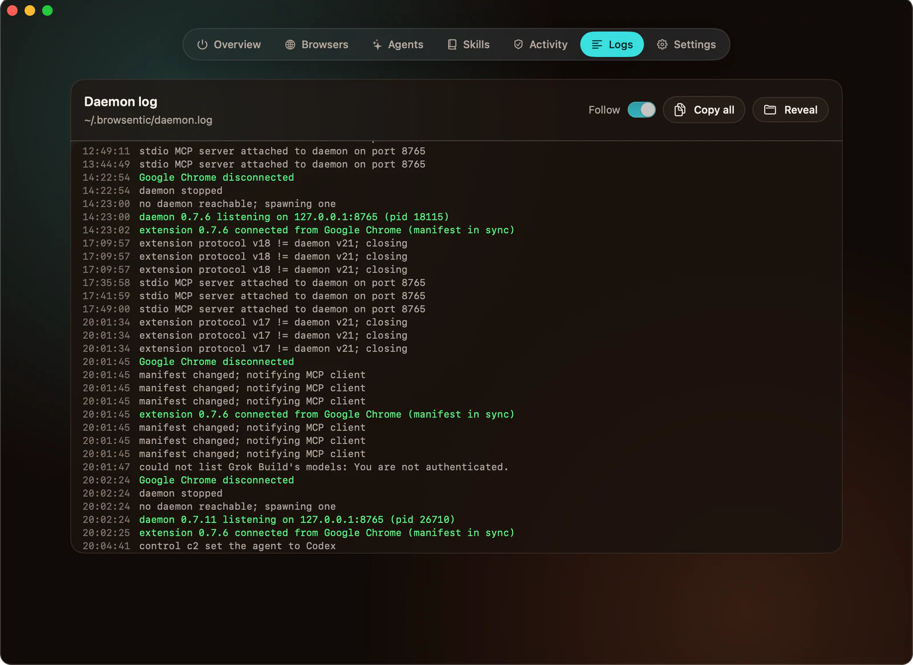
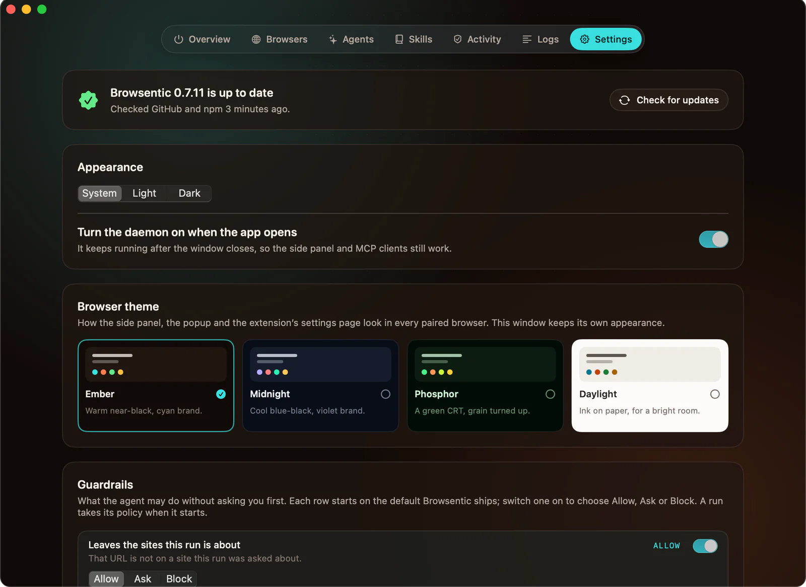

# Browsentic for macOS

The Mac app installs and runs Browsentic Bridge, the program on your computer that starts your agent
CLI, and adds the extension to each browser from its store. It carries the same command and
background process as [`npx browsentic@latest setup`](install.md), installs them in `~/.browsentic`
and manages them without a terminal.

Requires macOS 14 or newer, on Apple silicon or Intel. On Windows, use the [Windows app](windows-app.md).

---

## Install

```sh
curl -fsSL https://browsentic.com/install.sh | sh
```

The script downloads the latest release, checks that the app’s signature is intact, copies
`Browsentic.app` into Applications, clears the quarantine flag on that copy and opens it. It does not
ask for a password. Set `BROWSENTIC_VERSION=0.6.2` to pin a release, or `BROWSENTIC_NO_OPEN=1` to
install without opening. [The script](https://browsentic.com/install.sh) is sixty lines, if you want
to read it first.

### From the disk image instead

Download `Browsentic-<version>.dmg` from the
[latest release](https://github.com/imshaikot/browsentic/releases/latest) and drag **Browsentic** onto
**Applications**. The build is not notarized yet and macOS quarantines browser downloads, so the
first open is blocked with “Apple could not verify Browsentic is free of malware”. Press **Done**,
then either press **Open Anyway** on the Browsentic line in **System Settings → Privacy & Security**,
or run:

```sh
xattr -dr com.apple.quarantine /Applications/Browsentic.app
```

On macOS 15 and newer, Right-click ▸ Open no longer gets past the block. The one-line install runs
the same `xattr` step for you after verifying the signature.

## The first screen: what your Mac already has

The app opens on five checks and runs them automatically:

| Check | Passes when | If it does not |
| --- | --- | --- |
| **This Mac** | always | Nothing to do |
| **Node.js runtime** | `node` 20 or newer is on your `PATH` | **Install** downloads the current LTS from nodejs.org into `~/.browsentic/runtime/node`, verified against its published SHA-256. No Homebrew, no password |
| **Browsentic Bridge** | `~/.browsentic/cli` holds the version this app carries | **Install** copies it there, writes the `browsentic` launcher to `~/.browsentic/bin`, and registers it with your browsers so they can start it |
| **A browser** | Chrome, Brave, Edge, Arc, Vivaldi, Opera, Chromium or Firefox is installed | **Get Chrome** opens the download page. Advisory: it does not block you |
| **An AI agent** | One of `claude`, `codex`, `agy`, `vibe`, `grok`, `cursor-agent`, `qwen` or `opencode` is on your `PATH` | **Install Claude Code** runs `npm i -g @anthropic-ai/claude-code`. Advisory |

**Set up everything** installs Node and the Bridge in one click. The browser, the extension and the
agent are your choice, so each has its own button. Once everything required is in place the app
moves on by itself; on later launches that takes about two seconds.

## Adding the extension

**Overview** has one row per browser on your Mac, showing where its extension came from and whether
it is connected. A browser without the extension has a button (**Add to Chrome**, **Add to Edge** or
**Get the Firefox add-on**) that opens the store page in that browser and shows a pairing code.
Press the store's button, click Browsentic in the toolbar and enter the code; the row turns
**Connected**.

**Load it unpacked instead**, under the rows, is for a browser that cannot reach a store or for an
unreleased build. It writes the extension to `~/browsentic/extension/chrome-mv3`, opens
`chrome://extensions` with that path on the clipboard, and shows **Reload needed** on that row when
the folder holds a newer build than the browser has loaded.

> **Why the unpacked extension is not in `~/.browsentic`.** Chrome’s **Load unpacked** dialog is the
> system folder picker, which hides dotfolders, and the browser derives an unpacked extension's ID
> from its absolute path. So the app puts it in `~/browsentic/extension/chrome-mv3`, where the
> command puts it, and everything else in `~/.browsentic`.

## The window

The tabs float at the top; ⌘1 to ⌘5 switch between them. Agents, Skills, Activity and Logs are
pages of **Settings**, picked from its sidebar.








| Tab | What you do there |
| --- | --- |
| **Overview** | Turn Browsentic Bridge on and off with the power button, restart it, see its address and version. One row per browser: where its extension comes from, whether it is connected, and a button that adds it from the store. The unpacked folder sits behind **Load it unpacked instead** |
| **Browsers** | Get a [pairing code](pair.md) with a live countdown, see every paired browser and the store its extension came from, unpair one or all |
| **Android** (experimental) | Whether a phone is ready to drive from the side panel: adb, the phone, USB debugging, Chrome, Chrome open and the screen, one row each, the same checks `browsentic android` prints. A row that fails says what to do, with **Open Chrome on the phone**, **Get Chrome** or the adb install command to copy. **Set up your phone** has the steps. The Bridge looks for phones only while this tab is open |
| **Settings** | Five pages, picked from its sidebar; see below |
| **About** | Who makes Browsentic, a GitHub star, every version on this computer with a copy button, **Report a bug** (GitHub's issue form with those versions filled in; nothing is sent until you submit it), and links to the guide, this page, [troubleshooting](troubleshooting.md) and the release notes. **Run the checks again** reruns the first-run checks |

| Settings page | What you do there |
| --- | --- |
| **General** | Light, dark or system appearance for this window; whether the Bridge starts with the app; the **Browser theme** and **Guardrails** every paired browser uses, the same rows as the extension's settings page, kept in step both ways; `browsentic` in your terminal; the line that registers Browsentic with an [MCP client](mcp-clients.md); uninstall |
| **Agents** | See which agent CLIs are ready, [switch](agents.md) between them, pick a model, install a missing one, or let Browsentic fix what one still needs |
| **Skills** | Every [skill](features/skills.md) the router can see and which folder it came from |
| **Activity** | Your standing [approvals](approvals.md), forgettable per site, and the downloads agents captured |
| **Logs** | `~/.browsentic/daemon.log`, followed live |

A menu bar item, the Browsentic mark with its centre dot filled while the Bridge runs, shows the
Bridge’s state and has the same on, off and restart controls.

**Closing the window does not stop anything.** The Bridge is a background process of its own, so
the side panel and any MCP client keep working with the app closed or quit.

## `browsentic` in your terminal

**Settings → General → “browsentic” in your terminal** links the launcher into a folder that is
already on your `PATH` and writable: `~/.local/bin`, `/opt/homebrew/bin` or `/usr/local/bin`. It
edits no shell profile and asks for no password. Every command in the
[CLI reference](../reference/cli.md) then works against the install the app manages.

If you also installed it with `npm i -g browsentic`, remove that copy (`npm rm -g browsentic`) so
two versions cannot drift apart.

## Updating

The app checks GitHub and npm for a newer release at launch and every few hours after. When one is
out, a card appears at the top of **Overview** (and in Settings) with **Update now**, which downloads
the release, checks its signature and that it is the version it claims to be, then replaces the app
and reopens it. The new app replaces the Bridge and restarts it. **Check for updates** on the same
card checks again immediately.

The extension updates itself from its store. Only an unpacked copy needs ↻ on its card at
`chrome://extensions`, and the app tells you when. The extension and the Bridge do not have to be
the same version.

A release reaches npm a few minutes before its Mac build is attached; until then the card says so
and offers **Check again**. If an update fails, nothing changes, and the card shows the install
line, which installs the same release from a terminal.

`browsentic update` does not replace an install the app made; it tells you to update from the app.

## Uninstall

**Settings → General → Uninstall…** runs [`browsentic uninstall`](../reference/cli.md#uninstall):
it unpairs every browser, stops the Bridge and removes `~/.browsentic` and `~/browsentic`,
optionally keeping your skills. Remove the extension from each browser first (right-click its
toolbar icon → **Remove**), and drag the app to the Trash afterwards.

## Building it yourself

```sh
yarn mac:dmg        # → dist/mac/Browsentic.app and dist/mac/Browsentic-<version>.dmg
```

This needs the Swift toolchain (Xcode or the Command Line Tools). The source is a SwiftPM package in
[`src/mac/`](../../src/mac); see [internals/mac-app.md](../internals/mac-app.md).
