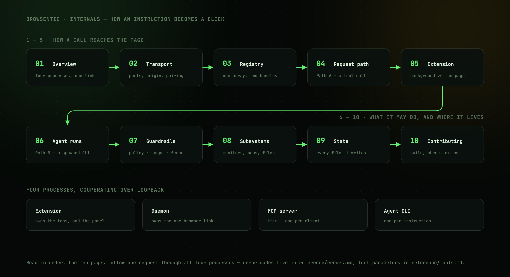

# Internals

How an instruction becomes a click, end to end.

Browsentic is four processes cooperating over loopback: a browser extension, a local daemon, one
stdio MCP server per client, and — when the side panel is driving — a headless agent CLI.

Read in order, these pages follow a request through all of them:

| | |
| --- | --- |
| **1.** [Overview](overview.md) | The four processes, and why a Manifest V3 extension forces a daemon |
| **2.** [Transport](transport.md) | Ports, the `Origin` gate, the mutual pairing handshake, protocol versioning |
| **3.** [The action registry](registry.md) | One definition compiled into two bundles; names, drift detection, reserved actions |
| **4.** [Request path](request-path.md) | Path A — an MCP client's tool call reaching the page |
| **5.** [Inside the extension](extension.md) | Background vs content script, self-healing injection, tab scoping |
| **6.** [Agent runs](agent-runs.md) | Path B — the intent funnel, the spawned CLI, prompt assembly, skill routing |
| **7.** [Guardrails](guardrails.md) | The declarative policy, run scope, result fencing, spawn containment |
| **8.** [Subsystems](subsystems.md) | Monitors, recordings, site maps, files, screenshots |
| **9.** [State on disk](state.md) | Every file Browsentic writes, and why it is where it is |
| **10.** [Contributing](contributing.md) | Build topology, the checks, and adding a capability |

Looking for an error code? [reference/errors.md](../reference/errors.md).

Looking for a tool's parameters? [reference/tools.md](../reference/tools.md).
