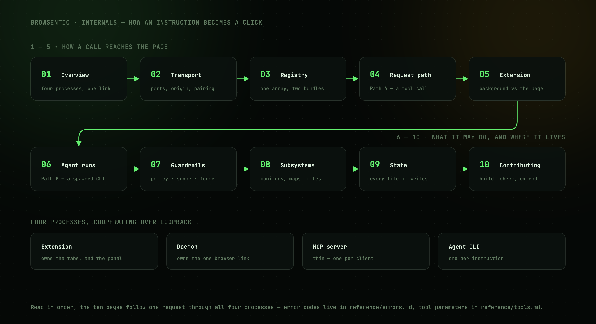

# Internals

How Browsentic is built: the processes it runs, how they connect, and the path a request takes
from the side panel or an MCP client to the page.

Browsentic is a browser harness of four processes that talk over loopback: the extension, which
hosts the side panel; the daemon (Browsentic Bridge); the headless agent CLI the daemon spawns for a
side-panel run; and, on the optional MCP path, one stdio MCP server per external client.

Read in order, these pages follow a request through all of them:

| | |
| --- | --- |
| **1.** [Overview](overview.md) | The parts and how they connect, and why a Manifest V3 extension needs a daemon |
| **2.** [Transport](transport.md) | Ports, the `Origin` gate, the mutual pairing handshake, the protocol window |
| **3.** [The action registry](registry.md) | One definition compiled into two bundles; names, drift detection, reserved actions |
| **4.** [Request path](request-path.md) | Path A: an MCP client's tool call reaching the page |
| **5.** [Inside the extension](extension.md) | Background vs content script, self-healing injection, the panel, the rail and the orb, tab scoping |
| **6.** [Agent runs](agent-runs.md) | Path B: the intent funnel, the runners, prompt assembly, the file and captcha analysts, skill routing |
| **7.** [Guardrails](guardrails.md) | The declarative policy, run scope, result fencing, spawn containment |
| **8.** [Subsystems](subsystems.md) | Monitors, recordings, site maps, files, screenshots |
| **9.** [State on disk](state.md) | Every file Browsentic writes, and why it is where it is |
| **10.** [Contributing](contributing.md) | Build topology, the checks, and adding a capability |
| **11.** [The macOS app](mac-app.md) | What is native, what stays in the daemon, and how the payload is laid down |
| **12.** [The Windows app](windows-app.md) | The Tauri and React app, the launcher, the PATH, and how it updates |
| **13.** [Store listings](stores.md) | The Chrome Web Store and Edge Add-ons IDs, submitting an update, and every field the dashboards ask for |

Error codes are in [reference/errors.md](../reference/errors.md), and each tool's parameters in
[reference/tools.md](../reference/tools.md).
