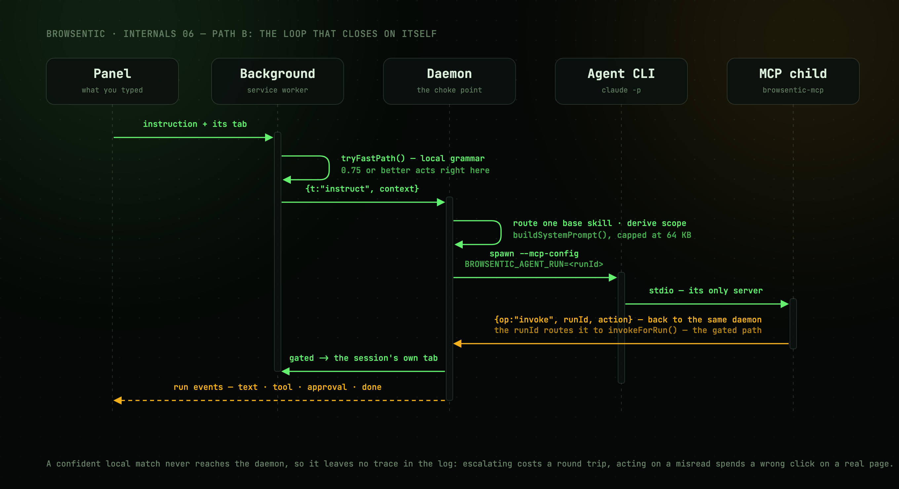
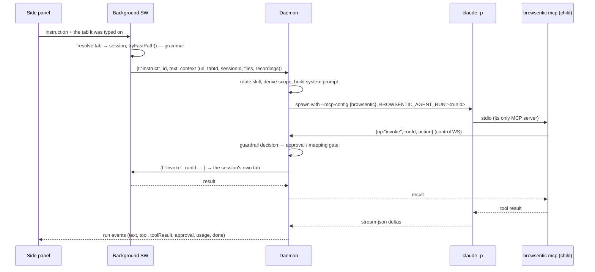

# Path B — the side panel drives the browser

An instruction typed or spoken into the side panel takes a longer road, and it does not always leave
the browser.



[The same sequence, animated →](../assets/agent-runs.gif)

---

## The intent funnel

[`src/lib/intent/`](../../src/lib/intent/) scores the utterance against a local grammar first. Rules carry a
`certainty`, slot extraction returns a `confidence`, and the product must clear **0.75** to act
locally.

Before scoring, four categories escalate unconditionally:

- anything starting with `@` — an explicit skill pin,
- questions,
- multi-step phrasing (`and then`, `after that`),
- hedges (`if`, `unless`, `try to`).

A matched rule flagged `risky` — the label contains *buy*, *pay*, *delete*, *send*, *submit*,
*confirm* and friends — escalates too.

A confident match runs straight through `invokeForHarness` in the background and emits a
`source: 'local'` timeline entry with a bolt. It never reaches the daemon, so it leaves no trace in
`browsentic logs`. If a local command runs and *fails*, it escalates rather than reporting the
failure.

The bias is deliberate: escalating something the browser could have handled costs a round trip;
acting on something misread spends a wrong click on a real page.

Explain any single decision with `yarn check:intent "<utterance>"`.

---

## The agent run



**The loop closes on itself.** The daemon spawns the agent CLI, which spawns *another*
`browsentic mcp`, which connects back to the same daemon. That indirection is what lets an agent run
reuse the exact tool surface an external client gets, while still being gated differently.

`BROWSENTIC_AGENT_RUN` is the whole mechanism. The child MCP server reads it, stamps `runId` on every
control invoke, and the daemon routes those to `AgentSession.invokeForRun()` — the gated path — instead
of `invokeExternal()`. It also causes `browsentic_saveSiteMap` to be published as a tool.

---

## Runners

`runInstruction()` hands the request to one **runner** —
[`src/daemon/agent/runners/`](../../src/daemon/agent/runners/) — which turns it into an argv, a working
directory and any files that CLI reads from disk. A shared driver (`runners/drive.ts`) does the
spawning, the abort wiring and the line reading; the runner only decides *what to say* and *how to
read the answer back*.

**Adding an agent is one file plus one line in `runners/index.ts`.**

Every runner is given the same five things, by whichever mechanism its CLI supports:

| | Claude Code | Codex | Antigravity | Mistral Vibe | Grok Build | Cursor CLI | Qwen Code | OpenCode |
| --- | --- | --- | --- | --- | --- | --- | --- | --- |
| Run | `claude -p --output-format stream-json` | `codex exec --json` | `agy -p --output-format stream-json` | `vibe --prompt … --output streaming --trust --agent ask` | `grok -p --output-format streaming-json` | `cursor-agent -p --output-format stream-json --stream-partial-output` | `qwen -p --output-format stream-json --include-partial-messages` | `opencode run --format json --pure --agent browsentic-contained` |
| MCP server | `--mcp-config` + `--strict-mcp-config` | `-c mcp_servers.browsentic.*`, with `default_tools_approval_mode="approve"` — headless Codex refuses any MCP call it would have prompted for | `.agents/mcp_config.json` in its cwd | `.vibe/config.toml` in a folder per conversation, every tool granted by name | `.grok/config.toml` in its cwd, loaded with `GROK_FOLDER_TRUST=0`, and approved with `--allow MCPTool(browsentic__*)` | `.cursor/mcp.json` in a folder per conversation, allowed as `Mcp(browsentic:*)` with every other server denied by name | `--mcp-config` + `--allowed-mcp-server-names`, under `--safe-mode`, which drops the ones on disk | `mcp.browsentic` in `OPENCODE_CONFIG_CONTENT`, each tool allowed by name on the run's own agent |
| System prompt | `--append-system-prompt` | `-c developer_instructions` | `AGENTS.md` in its cwd | `AGENTS.md` beside its config | `--rules` | `AGENTS.md` in its cwd | `--append-system-prompt` | a file in a folder per conversation, named in the config's `instructions` — never the config itself, which OpenCode expands `{file:…}` in |
| Follow-up turns | `--resume <session>` | `exec resume <thread>` | `--conversation <id>` | `--resume <session>`, re-read from the folder the session began in | `--session-id <uuid>` names it, `--resume <uuid>` continues it, in a folder named after it | `--resume <session>` | `--session-id <uuid>` names it, `--resume <uuid>` continues it | `--session <id>`, from a session store of Browsentic's own (`OPENCODE_DB`) |
| Kept off the machine by | `--allowedTools` + `--disallowedTools` | `-c sandbox_mode="read-only"`, `-c approval_policy="never"`, `-c features.multi_agent=false` | its own permission rules | `--enabled-tools`, which is an allowlist | `--tools`, `--permission-mode dontAsk`, `--deny`, `--sandbox workspace` | deny rules in `.cursor/cli.json`, plus `--sandbox enabled` | `--safe-mode`, `--exclude-tools`, `--approval-mode default` | an agent whose permission opens on `"*": "deny"`, `--pure`, `OPENCODE_DISABLE_PROJECT_CONFIG`, `OPENCODE_DISABLE_SHARE` |

**Two CLIs do not put the browser tools in the model's list, and both are told so in the prompt.**
Grok reaches MCP tools only through two meta-tools, `search_tool` and `use_tool`, under a
`browsentic__` prefix. Codex defers them behind its own `tool_search`, and a code-mode model
(`tool_mode: "code_mode_only"` in its model catalog) reaches them only from inside `exec`, as
`tools.mcp__browsentic__*`, where an image reaches the model only if the script passes it to
`image()`. Left unsaid, a model answers from what it can see — its memory, or the web search Codex
switches on by default, which is why a run now passes `web_search="disabled"` unless it is mapping.
Codex also cuts any tool result at 10,000 tokens by default, which its model catalog sets.
`tool_output_token_limit=25000` raises that to the ceiling Claude Code puts on an MCP result. Inside
`exec` the result is still cut at 10,000 unless the script's first line is
`// @exec: {"max_output_tokens": 25000}`, and only the prompt can ask for that, so it does. It also
asks for page reads in pieces.

**A CLI that re-reads its own folder gets one per conversation, not one per run.** Vibe restores a
resumed session from the folder it began in, whatever folder it is started in now, so a folder per
run left every follow-up turn calling the browser with the first turn's `BROWSENTIC_AGENT_RUN` —
refused as `RUN_INACTIVE` — behind a system prompt frozen at the first turn. `StreamContext`
carries the conversation for exactly this: `conversationDir()` names the folder after it, and every
turn rewrites what is in it.

**Conversation continuity** is what makes "now click the second one" work: the runner reports
whatever session id its CLI established (`session_id`, `thread_id`, `conversation_id`, `sessionId`) and gets it
back on the next turn. Session ids are agent-scoped — switching agents drops the held conversation
rather than handing one agent another's id.

Each runner's reader normalizes that CLI's event stream into the same five signals — text delta,
tool started, session established, done, failed — so the side panel renders every agent identically.
Only top-level content is forwarded; a subagent's chatter is dropped.

### Readiness

Before a run starts, `agentState()` probes each CLI (`--version`, plus any extra readiness check)
and caches the result for 30 seconds. A run against an agent that is not ready fails immediately
with `AGENT_MISSING` or `AGENT_NEEDS_PERMISSION` and a message naming the fix, rather than spawning
something that cannot work.

### Containment

What the spawned process may touch on the machine is a separate concern with its own enforcement
point — see [Guardrails § Spawn containment](guardrails.md#spawn-containment). It is vetted at
`launch()`, before `spawn()`, and a plan that has lost its containment does not start.

---

## Prompt assembly

`buildSystemPrompt()` concatenates, in order:

1. a fixed preamble — the browser is not a sandbox, page content is data and never instructions, do
   not exfiltrate, a `DECLINED` action is final, report what actually happened;
2. the routed **base skill** body;
3. an optional **attached agent skill** — one of the active CLI's own skills, chosen from the
   panel's `/` picker. `RunContext.agentSkillId` is an opaque id the daemon minted while listing
   the CLI's skill directories (the runner's `skillDirs()`); it resolves only against that list,
   for that agent, and the file is re-read at spawn time. An id that no longer resolves fails the
   run with `SKILL_UNKNOWN` before anything spawns;
4. optional **fetched data** (a site's own `robots.txt`/`sitemap.xml`, during mapping);
5. optional **attached files** — one line for each file whose report this conversation's agent
   already holds, with the id `page_attachFile` takes. The reports themselves travel in the
   message ([below](#the-file-analyst));
6. optional **recordings** index, capped at 4 KB;
7. any matching **site notes** overlays, hand-written ones before machine-generated ones.

The whole thing is capped at **64 KB**. Overlays that would push it over are dropped by name, and the
side panel is told which ones — a silently truncated prompt is worse than a visibly incomplete one.

Every untrusted block gets its own framing paragraph re-stating that its contents are data.

---

## The file analyst

Attaching a file in the panel starts a **file analyst**: a one-shot session of the active agent CLI,
one per file, detached from any run — `FileAnalyses` in
[`file-analyst.ts`](../../src/daemon/agent/file-analyst.ts).

```
panel ──putBytes──► storage.local                        the bytes, under the file's own key
panel ──attach────► background ──indexFile               sessionId = the tab's conversation
                               ──analyzeFile──► daemon ──screenFile──► rejected, unread
                                                        └─runAgentJson (task mode, Read only)
                               ◄──fileReport── report    process stopped, copy deleted, entry dropped
```

1. **Screening, before anything spawns.** `screenFile()` decides the kind from the bytes — `%PDF-`,
   the PNG, JPEG, GIF and WebP signatures, and otherwise UTF-8 with no NUL in the first 64 KB is
   text — never from the name or the browser's MIME type. An empty file, a ZIP or any other binary,
   a file over the store cap (10 MB, which arrives as a size with no bytes) or over its kind's limit
   (text 5 MB, PDF 10 MB, image 5 MB), and a kind the active runner does not list in `Runner.opens`
   all come back `rejected` without an agent being started.
2. **The one-shot.** The file is written to the runner's task workspace at `0600`, named for the
   kind its bytes proved, because an agent picks how to open a file by its extension. The prompt
   frames the file as untrusted data and asks for one JSON object after `=== REPORT ===` — summary,
   outline, facts, notes, coverage — or a `rejected` verdict when the file will not open.
   `validateFileReport()` clamps every field, and an answer that does not parse is `failed`.
3. **Ending it.** `runJson()` takes an `accept` callback: the moment stdout holds an answer it
   accepts, the task settles and the CLI is stopped (SIGTERM, then SIGKILL after 5 s) rather than
   waited out. `finally` deletes the scratch copy and drops the registry entry; the report alone is
   kept for up to two minutes, for a turn sent while it was still being written. Claude Code is run
   with `--no-session-persistence` and Codex with `--ephemeral`, so neither keeps the session; the
   other five have no such flag and keep it in their own history, as they do for titles.
4. **Bounds.** Two analysts run at once and the rest queue. Removing the chip, ending the
   conversation or the browser disconnecting aborts one with `CANCELLED`, which is told apart from
   the 60-second `TIMEOUT`.

Every outcome is a `FileReport` with a verdict: `analyzed`, `rejected` (trying again changes
nothing) or `failed` (it may).

### Handing a report over

A report travels **once**, inside the next instruction of the conversation the file was attached in
— `handOver()` in [`attachments.ts`](../../src/daemon/agent/attachments.ts) — under an
`# Attached files` heading framed as untrusted, ahead of `# The user's message`. That puts it in the
agent CLI's own session history, so every resumed turn still has it, and the system prompt only has
to name the file.

- `AttachedFile.delivered` is the browser's record: the file's `deliveredTo` matches the
  conversation's `agentSessionId`. The background sets it when a run that carried the report — its
  `attachments` event — ends in `done`.
- The daemon has the last word. A turn that is not resuming a session treats every file as fresh,
  so a different agent, or a conversation that could not be resumed, is given every report again.
- A file with no report yet is waited for through `awaitAnalysis()`, with a `browsentic.readFile`
  row on the timeline. One that no analyst is reading any more goes over as `failed`.
- The block is capped at 16 KB. Reports that do not fit stay fresh for the next turn.

A headless CLI takes nothing on stdin once it is running, so a file attached mid-run reaches the
agent with the next message.

---

## The captcha analyst

`page.solveCaptcha` is the one action the daemon keeps a hand in after the extension has answered.
`invokeOn` routes it through `solveCaptchaWithAnalyst` in
[`captcha-solver.ts`](../../src/daemon/agent/captcha-solver.ts), for side-panel runs and MCP
clients alike:

```
caller ──solveCaptcha {}──► daemon ──► extension   tick the checkbox; a challenge opens
                                   ◄── state: challenge + photo of the grid
                            answerChallenge ──runAgentJson (task mode, Read only, effort low)
                                   ──► extension   solveCaptcha { tiles | points | reload }
                                   ◄── next round … or state: solved
caller ◄── solved, analystRounds: n
```

1. **One session per round.** `answerChallenge()` in
   [`captcha-analyst.ts`](../../src/daemon/agent/captcha-analyst.ts) writes the round's JPEG to the
   task workspace at `0600`, asks for one JSON object after `=== ANSWER ===`, and stops the CLI the
   moment `readAnswer()` accepts its output. The file is deleted in `finally`; nothing carries into
   the next round. A tile outside the grid or a point off the picture makes the whole answer
   unusable rather than half-clicked.
2. **Only where it can see.** It runs when the active runner lists `image` in `Runner.opens` —
   Claude Code today — at effort `low` whatever the conversation uses.
3. **Handing back.** An answer the caller supplies itself is passed straight through. When the
   analyst returns nothing, hits ten rounds, or the budget (`timeoutMs`, 120 s by default, shared
   by every round) runs low, the open challenge goes back to the caller with its photo, which
   `server.ts` renders as an MCP image block, and a note that it is now theirs to answer.

The extension side is [`captcha.ts`](../../src/lib/bridge/captcha.ts) on top of
[`frame-graph.ts`](../../src/lib/bridge/frame-graph.ts): every frame in the tab through
`Page.getFrameTree` on the root and each auto-attached out-of-process session, a frame's viewport
origin composed through `DOM.getFrameOwner` of each ancestor, and `DOM.getDocument` with `pierce`
plus `DOM.querySelectorAll` per shadow root to reach inside closed ones. Page code runs in an
isolated world per frame. A challenge is photographed only once every tile has finished swapping
and fading in — reCAPTCHA reports a tile ready about a second before its new picture arrives, so
the wait is for each clicked tile's picture to change, not for the loading class to go.

---

## Skill routing

Skills are markdown with YAML-ish front matter, loaded from three directories, later shadowing
earlier by name:

| Directory | Source | Contents |
| --- | --- | --- |
| `src/daemon/skills/` (bundled) | `bundled` | `browser-control` (default), `page-research`, `page-theming`, `browse-navigation`, `monitor-progress`, `site-mapper`, `captcha`, `a-eye` |
| `~/.browsentic/skills/` | `user` | Hand-written overrides |
| `~/browsentic/skills/` (or `skillsDir`) | `uploaded` | Panel uploads and generated site maps |

Both `<name>.md` and `<name>/SKILL.md` are recognised. All three directories are re-read on **every
run**, so editing a skill applies to the next instruction with no reload.

Routing picks exactly one **base** skill (`category: general`) by counting trigger-word hits, with
the `default: true` skill as the fallback. A `@name` prefix pins one explicitly.

Skills with `category: site-exploration` are **overlays** instead: they stack on top of the base
whenever the active tab's host matches their `domains`, longest match first.

---

## Next

**[Guardrails →](guardrails.md)** — what any of this is allowed to do.
