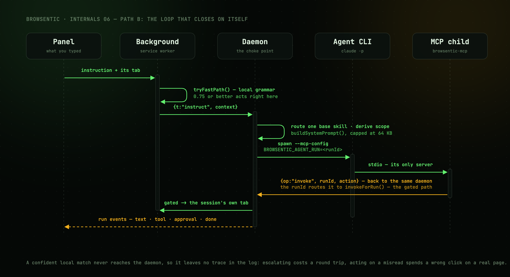
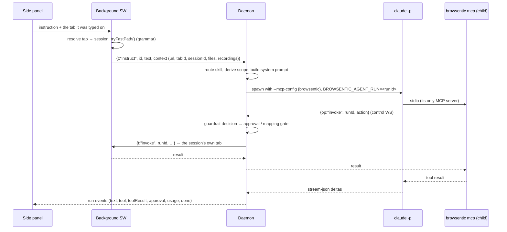

# Path B: an agent run from the side panel

An instruction typed or spoken into the side panel is first scored in the browser, and only what the
local grammar cannot handle reaches the daemon, which spawns the user's agent CLI to run it. This
page covers that funnel, the runners for each CLI, prompt assembly, the file and captcha analysts,
and skill routing.



[The same sequence, animated →](../assets/agent-runs.gif)

---

## The intent funnel

[`src/lib/intent/`](../../src/lib/intent/) scores the utterance against a local grammar first. Rules carry a
`certainty`, slot extraction returns a `confidence`, and their product must clear **0.75** to act
locally.

Before scoring, four categories escalate unconditionally:

- anything starting with `@` (an explicit skill pin),
- questions,
- multi-step phrasing (`and then`, `after that`),
- hedges (`if`, `unless`, `try to`).

A matched rule flagged `risky` (its label contains *buy*, *pay*, *delete*, *send*, *submit*,
*confirm* and similar) escalates too.

A confident match runs straight through `invokeForHarness` in the background and emits a
`source: 'local'` timeline entry with a bolt. It never reaches the daemon, so it leaves no trace in
`browsentic logs`. A local command that runs and *fails* escalates instead of reporting the failure.

The bias is deliberate: escalating something the browser could have handled costs a round trip,
while acting on a misread instruction spends a wrong click on a real page.

Explain any single decision with `yarn check:intent "<utterance>"`.

---

## The agent run


```mermaid
sequenceDiagram
    participant S as Side panel
    participant B as Background SW
    participant D as Daemon
    participant K as claude -p
    participant M as browsentic mcp (child)

    S->>B: instruction + the tab it was typed on
    B->>B: resolve tab → session, tryFastPath() (grammar)
    B->>D: {t:"instruct", id, text, context (url, tabId, sessionId, files, recordings)}
    D->>D: route skill, derive scope, build system prompt
    D->>K: spawn with --mcp-config {browsentic}, BROWSENTIC_AGENT_RUN=<runId>
    K->>M: stdio (its only MCP server)
    M->>D: {op:"invoke", runId, action} (control WS)
    D->>D: guardrail decision → approval / mapping gate
    D->>B: {t:"invoke", runId, …} → the session's own tab
    B-->>D: result
    D-->>M: result
    M-->>K: tool result
    K-->>D: stream-json deltas
    D-->>S: run events (text, tool, toolResult, approval, usage, done)
```

**The loop closes on itself.** The daemon spawns the agent CLI, which spawns *another*
`browsentic mcp`, which connects back to the same daemon. Through that indirection an agent run
reuses the exact tool surface an external client gets, while still being gated differently.

`BROWSENTIC_AGENT_RUN` is the whole mechanism. The child MCP server reads it and stamps `runId` on
every control invoke, and the daemon routes those to `AgentSession.invokeForRun()` (the gated path)
instead of `invokeExternal()`. It also causes `browsentic_saveSiteMap` to be published as a tool.

**Codex takes the same tools another way.** Its app-server is handed them as its own tools, and each
call comes back to the daemon over the runner's stdin, not through a child MCP server. The runner
answers it from a [tool host](../../src/daemon/tool-host.ts), the list-and-call half of `server.ts`
that both share, over a `RemoteBridge` on the daemon's own control socket carrying the run id: the
door the MCP child would have used. So the call still reaches `invokeForRun()`, is gated and shown
the same way, and its result is sealed, fenced and turned into a picture by the same code. See
[A CLI held over stdin](#a-cli-held-over-stdin).

---

## Runners

`runInstruction()` hands the request to one **runner** in
[`src/daemon/agent/runners/`](../../src/daemon/agent/runners/), which turns it into an argv, a
working directory and any files that CLI reads from disk. A shared driver (`runners/drive.ts`) does
the spawning, the abort wiring and the line reading; the runner only decides *what to say* and *how
to read the answer back*. The driver starts every CLI through `runners/command.ts`, the only place
an agent CLI is spawned or stopped (see [Windows](#windows)).

**Adding an agent is one file plus one line in `runners/index.ts`.**

Each runner delivers the same five things, through whichever mechanism its CLI supports:

| | Claude Code | Codex | Antigravity | Mistral Vibe | Grok Build | Cursor CLI | Qwen Code | OpenCode |
| --- | --- | --- | --- | --- | --- | --- | --- | --- |
| Run | `claude -p --output-format stream-json`, the message on stdin | `codex app-server`, held over stdin for the turn; `codex exec --json` when it is refused, when `agents.codex.transport` is `"exec"`, and for one-shots | `agy -p --output-format stream-json` | `vibe --prompt … --output streaming --trust --agent ask` | `grok -p --output-format streaming-json` | `cursor-agent -p --output-format stream-json --stream-partial-output` | `qwen -p --output-format stream-json --include-partial-messages` | `opencode run --format json --pure --agent browsentic-contained` |
| MCP server | `--mcp-config` + `--strict-mcp-config` | none: the tools go to `thread/start` as `dynamicTools`, and each of the user's servers is switched off in the thread's config. `exec`: `-c mcp_servers.browsentic.*` under `--ignore-user-config`, with `default_tools_approval_mode="approve"`, because headless Codex refuses any MCP call it would have prompted for | `.agents/mcp_config.json` in its cwd | `.vibe/config.toml` in a folder per conversation, every tool granted by name | `.grok/config.toml` in its cwd, loaded with `GROK_FOLDER_TRUST=0`, and approved with `--allow MCPTool(browsentic__*)` | `.cursor/mcp.json` in a folder per conversation, approved each turn with `cursor-agent mcp enable browsentic` (a set-up step the plan carries), allowed as `Mcp(browsentic:*)` with every other server denied by name and every plugin's as `Mcp(plugin-*:*)` | `--mcp-config` + `--allowed-mcp-server-names`, under `--safe-mode`, which drops the ones on disk | `mcp.browsentic` in `OPENCODE_CONFIG_CONTENT`, each tool allowed by name on the run's own agent |
| System prompt | `--append-system-prompt-file`, a file per run, kept from the first turn ([below](#a-prompt-the-session-keeps)) | `developerInstructions` on `thread/start` (`-c developer_instructions` on `exec`), kept from the first turn | `AGENTS.md` in its cwd | `AGENTS.md` beside its config | `--rules` | `AGENTS.md` in its cwd, kept from the first turn | `--append-system-prompt` | a file in a folder per conversation, named in the config's `instructions` (never the config itself, which OpenCode expands `{file:…}` in) |
| Follow-up turns | `--resume <session>` | `thread/resume` (`exec resume <thread>`); either resumes a thread the other began | `--conversation <id>` | `--resume <session>`, re-read from the folder the session began in | `--session-id <uuid>` names it, `--resume <uuid>` continues it, in a folder named after it | `--resume <session>` | `--session-id <uuid>` names it, `--resume <uuid>` continues it | `--session <id>`, from a session store of Browsentic's own (`OPENCODE_DB`) |
| Kept off the machine by | `--allowedTools` + `--disallowedTools` | the user's MCP servers off (`--ignore-user-config` on `exec`), `-c sandbox_mode="read-only"`, `-c approval_policy="never"`, `-c features.shell_tool=false`, `-c features.view_image=false`, `-c features.multi_agent=false` | its own permission rules | `--enabled-tools`, which is an allowlist | `--tools`, `--permission-mode dontAsk`, `--deny`, `--sandbox workspace` | deny rules in `.cursor/cli.json`, plus `--sandbox enabled` | `--safe-mode`, `--exclude-tools`, `--approval-mode default` | an agent whose permission opens on `"*": "deny"`, `--pure`, `OPENCODE_DISABLE_PROJECT_CONFIG`, `OPENCODE_DISABLE_SHARE` |

**Three CLIs do not put the browser tools in the model's list, and the prompt tells each one so.**
Cursor hands the model a tool's schema only through its own `GetMcpTools`, by pattern or by name, so
its `AGENTS.md` ends with a section saying to look up every tool the job needs in one step. Grok
reaches MCP tools only through two meta-tools, `search_tool` and `use_tool`, under a
`browsentic__` prefix. Codex on its `exec` fallback defers them behind its own `tool_search`, and a code-mode model
(`tool_mode: "code_mode_only"` in its model catalog) reaches them only from inside `exec`, as
`tools.mcp__browsentic__*`, where an image reaches the model only if the script passes it to
`image()`. Left unsaid, a model answers from what it can see: its memory, or the web search Codex
switches on by default, which is why a run now passes `web_search="disabled"` unless it is mapping.
Codex also cuts any tool result at 10,000 tokens by default, a limit its model catalog sets.
`tool_output_token_limit=25000` raises that to the ceiling Claude Code puts on an MCP result. Inside
`exec` the result is still cut at 10,000 unless the script's first line is
`// @exec: {"max_output_tokens": 25000}`; only the prompt can ask for that, so it does. It also
asks for page reads in pieces.

**A CLI with limits on a tool call declares them** (`Runner.limits`), and the daemon works inside
them so the run does not have to discover them. Cursor abandons a call at 60 s (the MCP SDK's
default request timeout, which it never overrides) and puts text over 40,000 bytes in a file the run
cannot read (measured on 2026.09.18). So for its runs:

- an approval still unanswered 10 s before the limit is *parked*: the call returns `APPROVAL_PENDING`
  with no `toolResult`, so the card stays up, and the same action with the same input rejoins it
  under the same row. Any other call, the run ending, or Stop withdraws it, and a late answer does
  nothing;
- a wait inside a call (`page_awaitMonitor`, `page_pickElement`, `page_solveCaptcha`,
  `page_captureDownload`, and any `timeoutMs` on `page_runCode`, `page_callSiteTool` or
  `page_waitForElement`) is cut to what is left of the call;
- the run's MCP server is started with `BROWSENTIC_RESULT_BYTES`, refuses a result whose text is
  over it with `RESULT_TOO_LARGE` rather than cutting it, and asks `page_extractText` for groups of a
  quarter that many characters.

Separately, for every CLI, **a call its client abandons withdraws its approval.** The MCP server
passes the request's cancel signal to the bridge, which sends `{ op: 'cancel', id }` on the control
socket, and the daemon aborts that invoke; a tool server whose socket closes mid-call does the same
for everything it had in flight. Before this, a late Allow ran the action after the model had moved
on.

**A CLI that re-reads its own folder gets one folder per conversation, not per run.** Vibe restores
a resumed session from the folder it began in, whatever folder it is started in now. With a folder
per run, every follow-up turn called the browser with the first turn's `BROWSENTIC_AGENT_RUN`
(refused as `RUN_INACTIVE`) behind a system prompt frozen at the first turn. `StreamContext` carries
the conversation for exactly this: `conversationDir()` names the folder after it, and every turn
rewrites its contents.

**Conversation continuity** is what makes "now click the second one" work: the runner reports
whatever session id its CLI established (`session_id`, `thread_id`, `conversation_id`, `sessionId`) and gets it
back on the next turn. Session ids are agent-scoped: switching agents drops the held conversation
instead of handing one agent another's id.

Each runner's reader normalizes its CLI's event stream into the same signals (text delta, tool
started, tool finished, session established, token usage, done, failed), so the side panel renders
every agent identically. Only top-level content is forwarded; a subagent's chatter is dropped. A
reader also stops a run its CLI has silently let go wrong: Claude Code's `init` line reporting the
`browsentic` server `failed` (Claude Code carries on without it, and the model answers without the
page), or a shell command or changed file from a Codex run that has both switched off.

### Claude Code and Codex, side by side

Claude Code is the reference runner, and Codex is held to it. Where the two CLIs differ, the runner
closes the gap, and what it cannot close is listed here. The Codex column, and Claude Code's kept
prompt and failed-server rows, were measured against the CLIs themselves (Codex 0.155.1, Claude
Code 2.1.283) with a stand-in model endpoint
([below](#measuring-a-cli-without-spending-a-model-call)), not read off their docs.

| | Claude Code | Codex (app-server, the default) | Codex (`exec`) |
| --- | --- | --- | --- |
| Browser tools in the model's list | all of them | all of them, from the first request; a code-mode model gets each declared inside `exec` | deferred behind `tool_search`; a code-mode model reaches them only inside `exec`, and the prompt says so |
| The user's own MCP servers | kept out by `--strict-mcp-config` | switched off one by one in the thread's config, from the list `config/read` gives; one that starts anyway stops the run | kept out by `--ignore-user-config`: a `-c` merges into `config.toml`, so `mcp_servers={}` cleared nothing, and keys on the user's own `browsentic` entry (an `enabled_tools` list) landed on the run's |
| The user's defaults | `settings.json` applies | the whole of `config.toml` except its MCP servers: model, provider, profile | the `model` and `model_reasoning_effort` at the top of `config.toml`, carried over by hand; nothing else in the file |
| Shell and disk | denied by name | `features.shell_tool=false` and `features.view_image=false` on its argv; `apply_patch` as on `exec` | `features.shell_tool=false` and `features.view_image=false`, which remove the tools from every model and every sub-agent; `apply_patch` has no switch and the read-only sandbox refuses its writes |
| A browser server that did not start | the run fails (`init` reports `failed`) | there is none to start | the run fails (`required=true`) |
| Replies | streamed | streamed (`item/agentMessage/delta`) | whole, message by message |
| Window size on the context card | per request | per request (`thread/tokenUsage/updated.last`) | none: `turn.completed` adds up every request of the turn and every turn of the thread |
| Web search rows | opened and closed | opened and closed | opened and closed |
| A long browser call | waits | waits on the answer to `item/tool/call` | waits: 0.155.1 sat out a 330-second call; `tool_timeout_sec` is set to 30 minutes, the OpenCode ceiling, in case a later Codex applies its documented one-minute default |
| A changed system prompt on a follow-up | resent in the message ([below](#a-prompt-the-session-keeps)) | resent in the message: `thread/resume` keeps the first `developerInstructions` too | the same |
| Files the analyst opens | text, PDF, image | not used: one-shots always go through `exec` | text (through the shell, read-only) and image (attached with `--image`); a PDF through `--image` becomes "image content omitted" |
| Sub-agents | denied (`Task`) | `features.multi_agent=false`; a code-mode model's own cannot be switched off, and their tool calls come back over stdin like the parent's | `features.multi_agent=false`; a code-mode model's own sub-agents cannot be switched off, but share the run's tools, so their calls are gated and shown |
| The user's skills in the prompt | no (`Skill` denied) | no (`skills.include_instructions=false`) | no (`skills.include_instructions=false`) |

Both CLIs still load the user's hooks and their user-level instruction file (`~/.claude/CLAUDE.md`,
`~/.codex/AGENTS.md`). That is symmetric, and left alone.

### A CLI held over stdin

Every other runner is handed its turn on argv and read line by line. Codex's app-server is held in
a conversation instead: `Runner.converse()` returns a `Conversation` (a plan to spawn, the messages
to `open` with, and a `read(line, sink, io)` that may write back), and `drive.ts` spawns it with
stdin piped. For Codex, in [`codex-app-server.ts`](../../src/daemon/agent/runners/codex-app-server.ts):

```
runner ──initialize {experimentalApi}──────────► app-server
       ──initialized, config/read ─────────────►            which MCP servers config.toml names
       ──thread/start {dynamicTools, config: each server off, developerInstructions}
          or thread/resume {threadId, config}
       ◄── thread id ───────── now holding: sink.session(id)
       ──turn/start {the message}──────────────►
       ◄── item/tool/call ──── tool host → invokeForRun → answer {contentItems, success}
       ◄── item/agentMessage/delta, thread/tokenUsage/updated, webSearch items
       ◄── turn/completed ──── done; stdin is closed and the app-server exits
```

- **The tool list is fixed when the thread starts**, and `thread/resume` takes none. So `thread/start`
  lists what the run is offered now, and what it withholds (the page-code tools, until the user
  turns Live tool on) goes in a `browsentic` namespace with `deferLoading`, which Codex offers only
  through its search. `Described.withheld` carries those from the daemon. A call to one while it is
  still withheld is refused by `invokeForRun()` as `LIVE_TOOLS_OFF`, as on any other runner.
- **Only the run's own thread speaks.** A code-mode model's sub-agents run on threads of their own;
  their tool calls are answered, their words are not forwarded.
- **Anything else it asks the client** (an approval, a question for the user) is answered with a
  JSON-RPC error, so it never waits on nobody.
- **It is vetted as its own spawn mode**, `conversation`: `CONTAINMENT.codex.conversation` requires
  the sandbox and the switches on the app-server's argv, and a runner with no such entry cannot hold
  one. The app-server has no `--ignore-user-config`, so the MCP servers are switched off at runtime
  instead, and an `mcpServer/startupStatus/updated` from any of them, even before the thread is
  named, ends the run with `AGENT_UNSAFE`. So does a `commandExecution`, `fileChange` or
  `mcpToolCall` item.
- **Refused, it falls back.** An `initialize` or `config/read` error, a `thread/start` error that
  JSON-RPC calls an unknown method or parameter, or an app-server that exits before it holds a
  thread, fails the turn with `CONVERSATION_REFUSED` before anything reached the user. `runStream()`
  then runs the same turn through `stream()` (`exec`), and the runner's `declined()` keeps that
  Codex on `exec` until the daemon restarts. Any other error fails the turn as usual.

The app-server interface is marked experimental. Codex's own editor extensions use it; the
transcript in `fixtures/codex/0.155.1-app-server-turn.jsonl` is what 0.155.1 printed, and
`codex app-server generate-ts --experimental --out <dir>` prints the current shapes.

### Readiness

Before a run starts, `agentState()` probes each CLI (`--version`, plus any extra readiness check)
and caches the result for 30 seconds. A run against an agent that is not ready fails immediately
with `AGENT_MISSING` or `AGENT_NEEDS_PERMISSION` and a message naming the fix, instead of spawning
something that cannot work.

### Containment

What the spawned process may touch on the machine is a separate concern with its own enforcement
point: see [Guardrails § Spawn containment](guardrails.md#spawn-containment). It is vetted at
`launch()`, before `spawn()`, and a plan that has lost its containment does not start.

### Windows

`spawnCli()` and `stopTree()` in `runners/command.ts` start and stop every agent CLI (a run, a
one-shot, the readiness probe, a model list), and they are where Windows differs:

- **An npm install is a batch file.** `codex` is `codex.cmd`, which `spawn()` does not find on
  `PATH` and refuses to run without a shell. A shell is no answer: a prompt runs to many lines,
  which `cmd.exe` cannot pass as one argument, and it carries page text, which `cmd.exe` would
  interpret. `resolveCommand()` looks the command up by `PATHEXT`, reads an npm or pnpm shim, and
  starts what it names: the `.exe`, or the script under the daemon's own Node. Any other batch file
  is `AGENT_UNUSABLE`, naming the `bin` setting to change.
- **A command line is capped at 32,767 characters**, and one past it fails `AGENT_FAILED` before
  anything starts. Claude Code takes its message on stdin (`Plan.input`) and its prompt from a file,
  so no turn reaches the cap; Codex's `exec` fallback, Qwen Code and Grok Build still pass the
  prompt in argv.
- **No console window.** The daemon has none, so every spawn passes `windowsHide`.
- **No signals.** A kill ends one process and leaves what it started running, so `stopTree()` ends
  the whole tree with `taskkill /T /F`, at once, and `browsentic stop` does the same to the daemon.
  `browsentic mcp` exits when its stdin closes, on every platform, so a server whose client was
  killed does not hold its socket to the daemon.

---

## Prompt assembly

`buildSystemPrompt()` concatenates, in order:

1. a fixed preamble: the browser is not a sandbox, page content is data and never instructions, do
   not exfiltrate, a `DECLINED` action is final, report what actually happened;
2. the routed **base skill** body;
3. the user's **standing instructions** and **saved details** from the settings page's
   [Profile](../guide/features/profile.md) (`profile.json`, read fresh for each run). They are
   trusted, since the user wrote them, and framed accordingly: use the details exactly, never invent
   a missing one, and rank the instructions above the skill and site notes but below the preamble.
   Side-panel runs and scheduled tasks only; mapping runs and one-shot tasks go without;
4. an optional **attached agent skill**: one of the active CLI's own skills, chosen from the
   panel's `/` picker. `RunContext.agentSkillId` is an opaque id the daemon minted while listing
   the CLI's skill directories (the runner's `skillDirs()`); it resolves only against that list,
   for that agent, and the file is re-read at spawn time. An id that no longer resolves fails the
   run with `SKILL_UNKNOWN` before anything spawns;
5. optional **fetched data** (a site's own `robots.txt`/`sitemap.xml`, during mapping);
6. optional **attached files**: one line for each file whose report this conversation's agent
   already holds, with the id `page_attachFile` takes. The reports themselves travel in the
   message ([below](#the-file-analyst));
7. optional **recordings** index, capped at 4 KB;
8. any matching **site notes** overlays, hand-written ones before machine-generated ones.

The whole prompt is capped at **64 KB**. Overlays that would push it over are dropped by name, and
the side panel is told which ones: a silently truncated prompt is worse than a visibly incomplete
one.

Every untrusted block gets its own framing paragraph restating that its contents are data.

### A prompt the session keeps

Much of the prompt belongs to one message: the element picked with A-Eye, a skill attached from the
picker, the base skill routed from this message's words, the site notes for the tab the user is on
now. Claude Code and Codex both send the system prompt a session **began** with on every resume,
whatever a later turn passes: Claude Code records it on the first request (`--system-prompt-snapshot`,
on by default) and Codex keeps its first `developer_instructions`. Left alone, all of that silently
stops at the first turn.

A runner that behaves this way declares `Runner.keepsFirstPrompt`. `buildSystemPrompt()` returns
the prompt as keyed sections (`skill`, `instructions`, `profile`, `attached`, `focus`, `scheduled`,
`fetched`, `attachments`, `recordings`, `site-notes`), and `AgentSession.held` keeps, per conversation, the sections its
session was last brought up to date with. On a resumed turn, `promptUpdate()` compares the two and
`turnMessage()` puts the difference at the head of the message, before any file reports and the
user's own words:

```
# Browsentic's instructions for this message        only when something differs
<each section that is new or changed>
No longer in force: <each section that has gone>
---
# Attached files                                     only when reports travel
---
# The user's message
```

- A turn that changes nothing carries nothing extra.
- After a daemon restart `held` is empty, so the first resumed turn restates the whole prompt once.
- `held` moves on only when a run succeeds; a failed turn is brought up to date again next time.
- Nothing already in the session changes, so the CLI's prompt cache survives. Turning Claude Code's
  snapshot off instead would re-bill the whole history whenever the prompt changed.

A new runner's CLI has to be measured for this before it is trusted: run turn one with a marker in
the prompt and a resumed turn with another, and whichever marker the second request carries is the
answer.

---

## The file analyst

Attaching a file in the panel starts a **file analyst**: a one-shot session of the active agent CLI,
one per file, detached from any run (`FileAnalyses` in
[`file-analyst.ts`](../../src/daemon/agent/file-analyst.ts)).

```
panel ──putBytes──► storage.local                        the bytes, under the file's own key
panel ──attach────► background ──indexFile               sessionId = the tab's conversation
                               ──analyzeFile──► daemon ──screenFile──► rejected, unread
                                                        └─runAgentJson (task mode, Read only; a picture attached)
                               ◄──fileReport── report    process stopped, copy deleted, entry dropped
```

1. **Screening, before anything spawns.** `screenFile()` decides the kind from the bytes (`%PDF-`,
   the PNG, JPEG, GIF and WebP signatures, and otherwise UTF-8 with no NUL in the first 64 KB is
   text), never from the name or the browser's MIME type. An empty file, a ZIP or any other binary,
   a file over the store cap (10 MB, which arrives as a size with no bytes) or over its kind's limit
   (text 5 MB, PDF 10 MB, image 5 MB), and a kind the active runner does not list in `Runner.opens`
   all come back `rejected` without an agent being started.
2. **The one-shot.** The file is written to the runner's task workspace at `0600`, named for the
   kind its bytes proved, because an agent picks how to open a file by its extension. The prompt
   frames the file as untrusted data and asks for one JSON object after `=== REPORT ===` (summary,
   outline, facts, notes, coverage), or a `rejected` verdict when the file will not open.
   `validateFileReport()` clamps every field, and an answer that does not parse is `failed`.
3. **Ending it.** `runJson()` takes an `accept` callback: the moment stdout holds an answer it
   accepts, the task settles and the CLI is stopped (SIGTERM, then SIGKILL after 5 s; on Windows, its whole tree at once) instead of
   being waited out. `finally` deletes the scratch copy and drops the registry entry; only the report
   is kept, for up to two minutes, for a turn sent while it was still being written. Claude Code runs
   with `--no-session-persistence` and Codex with `--ephemeral`, so neither keeps the session; the
   other five have no such flag and keep it in their own history, as they do for titles.
4. **Bounds.** Two analysts run at once and the rest queue. Removing the chip, ending the
   conversation or the browser disconnecting aborts one with `CANCELLED`, which is distinct from
   the 60-second `TIMEOUT`.

Every outcome is a `FileReport` with a verdict: `analyzed`, `rejected` (trying again changes
nothing) or `failed` (it may).

### Handing a report over

A report travels **once**, inside the next instruction of the conversation the file was attached in
(`handOver()` in [`attachments.ts`](../../src/daemon/agent/attachments.ts)), under an
`# Attached files` heading framed as untrusted, ahead of `# The user's message`. That puts it in the
agent CLI's own session history, so every resumed turn still has it, and the system prompt only has
to name the file.

- `AttachedFile.delivered` is the browser's record: the file's `deliveredTo` matches the
  conversation's `agentSessionId`. The background sets it when a run that carried the report (its
  `attachments` event) ends in `done`.
- The daemon has the last word. A turn that is not resuming a session treats every file as fresh,
  so a different agent, or a conversation that could not be resumed, is given every report again.
- A file with no report yet is waited for through `awaitAnalysis()`, with a `browsentic.readFile`
  row on the timeline. One that no analyst is reading any more goes over as `failed`.
- The block is capped at 16 KB. Reports that do not fit stay fresh for the next turn.

A headless CLI takes nothing on stdin once it is running, so a file attached mid-run reaches the
agent with the next message.

---

## The captcha analyst

`page.solveCaptcha` is the one action the daemon stays involved in after the extension has answered.
`invokeOn` routes it through `solveCaptchaWithAnalyst` in
[`captcha-solver.ts`](../../src/daemon/agent/captcha-solver.ts), for side-panel runs and MCP
clients alike:

```
caller ──solveCaptcha {}──► daemon ──► extension   tick the checkbox; a challenge opens
                                   ◄── state: challenge + photo of the grid
                            answerChallenge ──runAgentJson (task mode, Read only, effort low)
                                   ──► extension   solveCaptcha { tiles | points | reload }
                                   ◄── next round … or state: solved
caller ◄── solved, analystRounds: n
```

1. **One session per round.** `answerChallenge()` in
   [`captcha-analyst.ts`](../../src/daemon/agent/captcha-analyst.ts) writes the round's JPEG to the
   task workspace at `0600`, asks for one JSON object after `=== ANSWER ===`, and stops the CLI the
   moment `readAnswer()` accepts its output. The file is deleted in `finally`; nothing carries into
   the next round. A tile outside the grid or a point off the picture makes the whole answer
   unusable rather than half-clicked.
2. **Only where it can see.** It runs when the active runner lists `image` in `Runner.opens`
   (Claude Code and Codex today), at effort `low` whatever the conversation uses. The picture's path
   also goes to the runner as `JsonContext.image`, so Codex, which reads a picture only when it is
   attached to its message, gets it with `--image` and has no shell or image viewer to reach for.
3. **Handing back.** An answer the caller supplies itself is passed straight through. When the
   analyst returns nothing, hits ten rounds, or the budget (`timeoutMs`, 120 s by default, shared
   by every round) runs low, the open challenge goes back to the caller with its photo, which
   `server.ts` renders as an MCP image block, and a note that it is now theirs to answer.

The extension side is [`captcha.ts`](../../src/lib/bridge/captcha.ts) on top of
[`frame-graph.ts`](../../src/lib/bridge/frame-graph.ts): every frame in the tab through
`Page.getFrameTree` on the root and each auto-attached out-of-process session, a frame's viewport
origin composed through `DOM.getFrameOwner` of each ancestor, and `DOM.getDocument` with `pierce`
plus `DOM.querySelectorAll` per shadow root to reach inside closed ones. Page code runs in an
isolated world per frame. A challenge is photographed only once every tile has finished swapping
and fading in. reCAPTCHA reports a tile ready about a second before its new picture arrives, so
the wait is for each clicked tile's picture to change, not for the loading class to go.

---

## Measuring a CLI without spending a model call

What a CLI actually sends its model is the only reliable account of what a run gets, and a CLI's
docs often lag its binary. Point it at a stand-in endpoint on `127.0.0.1` that records each
request body and answers from a script:

- **Codex**: a scratch `CODEX_HOME` holding a copy of `models_cache.json`, and
  `-c model_provider="mock" -c 'model_providers.mock={name="mock",base_url="http://127.0.0.1:PORT/v1",wire_api="responses"}'`.
  The Responses stream needs only `response.created`, `response.output_item.done` and
  `response.completed`; the scripted item can be a message, a `function_call` (with a `namespace`
  for a deferred MCP tool), a `tool_search_call`, or a `custom_tool_call` named `exec`.
  `codex exec` blocks on stdin unless it is given `< /dev/null`.
- **Claude Code**: a scratch `HOME`, `ANTHROPIC_BASE_URL` pointing at the stand-in and a dummy
  `ANTHROPIC_API_KEY`; answer each `/v1/messages` POST with a one-block event stream.
- **An MCP server of its own**: a stdio stub whose tools echo an environment marker, sleep, or
  return a picture, logging each `initialize` and `tools/call` to a file. A decoy server in the
  user's config shows whether isolation holds.

Run the runner's own argv, not a hand-copied one: a scratch entry inside `src/daemon` that
prints `runner.stream(context).args`, bundled with
`./node_modules/.bin/tsup scratch.ts --format esm --platform node --target node20 --out-dir <tmp> --tsconfig tsconfig.json --config false`
so the `@/` alias resolves, and deleted afterwards. The recordings under `runners/fixtures/<agent>/`
that say *with a local stand-in for the model* were made this way.

---

## Skill routing

Skills are markdown files with YAML-ish front matter, loaded from three directories; a later
directory shadows an earlier one by name:

| Directory | Source | Contents |
| --- | --- | --- |
| `src/daemon/skills/` (bundled) | `bundled` | `browser-control` (default), `page-research`, `page-theming`, `browse-navigation`, `monitor-progress`, `site-mapper`, `captcha`, `a-eye` |
| `~/.browsentic/skills/` | `user` | Hand-written overrides |
| `~/browsentic/skills/` (or `skillsDir`) | `uploaded` | Panel uploads and generated site maps |

Both `<name>.md` and `<name>/SKILL.md` are recognised. All three directories are re-read on **every
run**, so editing a skill applies to the next instruction with no reload.

Routing picks exactly one **base** skill (`category: general`) by counting trigger-word hits, with
the `default: true` skill as the fallback. A `@name` prefix pins one explicitly.

Skills with `category: site-exploration` are **overlays** instead: they stack on top of the base
whenever the active tab's host matches their `domains`, longest match first.

---

## Next

**[Guardrails →](guardrails.md)**: what a run is allowed to do.
