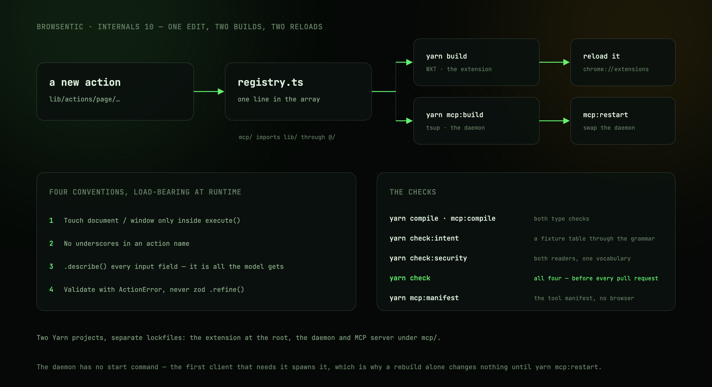

# Contributing

Build topology, the checks, and how to add a capability.



---

## Two Yarn projects

Separate lockfiles.

| | Extension | Daemon + MCP |
| --- | --- | --- |
| Root | `/` | `/mcp` |
| Bundler | WXT (Vite) | tsup |
| Output | `dist/chrome-mv3` | `src/daemon/dist` |
| Stack | React 19, Tailwind v4, shadcn/ui, zod | Node ≥20, `@modelcontextprotocol/sdk`, `ws`, zod |
| Build | `yarn build` | `yarn daemon:build` |

`src/daemon/` imports `src/lib/` through the `@/` alias, which is how [one registry](registry.md) ends up in two
bundles.

`node scripts/setup.mjs` (`yarn setup`) runs all four steps — both installs, both builds — using the
Yarn release vendored in the repository, so a fresh clone needs nothing on `PATH` but Node.

---

## Commands

```sh
yarn dev              # build, launch a throwaway Chrome profile, hot reload
yarn dev:firefox
yarn build            # production build
yarn zip              # store-ready archive
yarn lint:firefox     # what addons.mozilla.org's validator will say about dist/firefox-mv2
yarn sign:firefox     # have addons.mozilla.org sign dist/firefox-mv2 (needs the AMO keys; see below)
yarn compile          # type check the extension
yarn daemon:compile      # type check the daemon
yarn daemon:dev          # rebuild the daemon on change
yarn daemon:restart      # rebuild, then swap the running daemon for the fresh build
yarn daemon:manifest     # print the tool manifest, no browser needed
yarn test             # every test; pass a path to run fewer
yarn test:integration # only the tests that start a real daemon
yarn coverage         # the tests, then coverage by area against its floors
yarn check:intent "<utterance>"   # how the local grammar routes one instruction
yarn check            # both type checks, then the tests and their coverage floors
```

**Run `yarn check` before opening a pull request.** If you touched the action registry, also run
`yarn daemon:manifest` and keep [reference/tools.md](../reference/tools.md) in step with what it prints.

### The daemon keeps the old build in memory

The daemon has no start command: the first CLI or MCP client that needs it spawns it, and it lives
until `browsentic stop` or 30 idle minutes with nothing attached.

The flip side is that **a rebuild alone changes nothing while a daemon is running**. That is what
`yarn daemon:restart` is for: it rebuilds, stops the stale daemon and brings up the fresh build. The
extension cannot spawn the daemon; it only reconnects to one.

---

## Signing a Firefox build by hand

The release workflow signs every tagged build through addons.mozilla.org and attaches the `.xpi`,
so this is only for checking a change against Mozilla's signer before a release. Two things make it
unlike any other build step:

- **AMO signs a version once per add-on id, ever.** A signed version number is spent even if the
  file is thrown away. Never sign the version in `package.json`; patch a fourth part onto the built
  manifest instead, which leaves the real number for the release:

  ```sh
  yarn build:firefox
  node -e 'const p="dist/firefox-mv2/manifest.json",m=require("./"+p);m.version+=".1";require("fs").writeFileSync(p,JSON.stringify(m))'
  export WEB_EXT_API_KEY='user:…'   # addons.mozilla.org → Developer Hub → Manage API Keys
  read -s 'WEB_EXT_API_SECRET?AMO secret: ' && export WEB_EXT_API_SECRET
  yarn sign:firefox
  ```

- **Unlisted means self-hosted.** The signed file installs in release Firefox from `about:addons`
  and updates from the `update_url` in [wxt.config.ts](../../wxt.config.ts), which points at the
  latest GitHub release. A build signed by hand therefore updates itself to the next release too.

`yarn lint:firefox` runs the same validator first, with no keys; it should report no errors and no
notices. The warnings it does report are the bundle's `Function` and `innerHTML` uses, plus one
about Firefox for Android, which learned the data-collection key two versions after desktop and
which this build does not target. The automated signer accepts all of them.

## Adding a capability

Write `src/lib/actions/page/<name>.ts` and add it to the array in `src/lib/actions/registry.ts`. That single
edit publishes it as an MCP tool, because the daemon bundles the same registry.

Four conventions are load-bearing at runtime rather than at compile time:

1. **Touch `document`/`window` only inside `execute()`** — the module is also imported by the daemon,
   where there is no DOM.
2. **No underscores in action names** — they break the [tool-name round trip](registry.md#names).
3. **`.describe()` every input field** — the text becomes the tool's JSON Schema documentation, and
   it is all the model gets.
4. **Validate with `ActionError` inside `execute()`**, not zod `.refine()`/`.transform()` — those do
   not survive JSON Schema conversion.

Then rebuild **both** halves and reload the extension at `chrome://extensions`. Chrome does not
auto-reload unpacked extensions, and a stale service worker is the usual cause of a drifted manifest.

### If the capability is consequential

Add a rule to [`src/daemon/guardrails/policy.ts`](../../src/daemon/guardrails/policy.ts) rather than a
check inside the action — the policy is meant to be printable and diffable in one place. If it needs
a new predicate, add it to `CONDITIONS`; the vocabulary is closed on purpose.

### If it should be reachable from the side panel without an agent

Add a rule to [`src/lib/intent/grammar.ts`](../../src/lib/intent/grammar.ts) and a case to the table in
[`route.test.ts`](../../src/lib/intent/route.test.ts). Bias toward escalating — see
[the intent funnel](agent-runs.md#the-intent-funnel).

---

## Adding an agent runner

One file in [`src/daemon/agent/runners/`](../../src/daemon/agent/runners/) plus one line in
`runners/index.ts`. The shared driver does the spawning, abort wiring and line reading; your runner
decides what to say and how to read the answer back.

You must also add a `CONTAINMENT` entry in
[`src/daemon/guardrails/spawn.ts`](../../src/daemon/guardrails/spawn.ts) declaring which containment mode
that CLI supports and what its plan must carry. `vetPlan()` refuses to spawn a runner whose plan does
not match — that is the point, and [`spawn.test.ts`](../../src/daemon/guardrails/spawn.test.ts) asserts it
without spawning anything. Those tests walk every agent in the catalog, so a new runner is covered the
moment it exists; add tampering cases for the flags its containment depends on.

---

## See also

- [The action registry](registry.md) — why the manifest cannot drift silently
- [Guardrails](guardrails.md) — where enforcement lives
- [reference/tools.md](../reference/tools.md) — the page to keep in step
