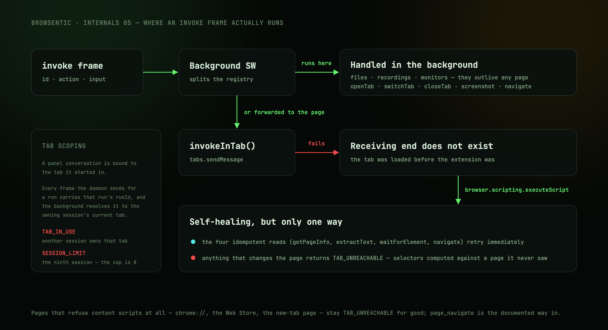

# Inside the extension

Where an invoke frame actually runs, and how a run stays in its own tab.

---

## Background vs content script

Not every capability can run in the page. The background service worker splits them:

| Handled entirely in the background | Why |
| --- | --- |
| `listFiles`, `attachFile`, `listRecordings`, `readRecording` | The data lives in extension storage |
| `startMonitor`, `monitorStatus`, `awaitMonitor`, `stopMonitor` | Monitors outlive any single page |
| `startDiagnostics`, `readConsole`, `readNetwork`, `stopDiagnostics` | The debugger attaches to a tab, and the buffers outlive any single page |
| `openTab`, `switchTab`, `closeTab`, `screenshot`, `navigate` | Need the `tabs`/`scripting` APIs |
| Everything else | Forwarded to the content script |

## The microphone is granted from a tab

Chromium anchors a permission prompt to a tab. A side panel and a popup have none, so
`getUserMedia` there is refused without ever asking, and no manifest permission grants the
microphone to an extension. `use-speech.ts` therefore reads `navigator.permissions` first: on
`prompt` it never calls `getUserMedia` — repeated silent refusals would earn the origin a temporary
block — and offers **Allow microphone** instead. That opens the unlisted `mic-permission.html`
entrypoint in a tab, where the prompt can appear. The grant belongs to the extension's origin, so the
panel and the popup both see the `PermissionStatus` change and start listening without a reload.
Firefox prompts from its sidebar on its own and skips the check.

## The Firefox build is signed, and says who it is

`yarn build:firefox` produces a Manifest V2 extension from the same source, and its manifest carries
a `browser_specific_settings.gecko` block the Chrome build has no use for:

- **`id: browsentic@browsentic.com`** — addons.mozilla.org signs nothing without a permanent id,
  and the first signing bound this one to the project's AMO account for good. Changing it would make
  every installed copy a different add-on.
- **`update_url`** — the `updates.json` under the latest GitHub release. Every signed build carries
  this URL, so moving it means every older install stops updating; the release job publishes the
  file next to each signed `.xpi`.
- **`data_collection_permissions: websiteContent`** — Firefox shows this at install. It is the honest
  declaration: what the agent reads on a page leaves the browser for the daemon and reaches the model
  behind whichever agent CLI the user runs.
- **`strict_min_version: 140.0`** — the first Firefox that understands the data-collection key.

Two permissions are filtered out of that build, `sidePanel` and `debugger`: Firefox has neither, and
AMO's validator flags each name it does not know. The Firefox sidebar is `sidebar_action`, which WXT
derives from the same entrypoint, and the nine tools that need the debugger are left off the list a
Firefox build offers (see [Background vs content script](#background-vs-content-script)).

## Self-healing injection

The forwarding call is `invokeInTab()`. A tab that loaded *before* the extension did has no content
script, so `tabs.sendMessage` fails with `Receiving end does not exist`. The extension then injects
the content script via `browser.scripting.executeScript` and:

- for the four idempotent reads (`getPageInfo`, `extractText`, `waitForElement`, `navigate`) it
  **retries immediately**;
- for anything that *changes* the page it returns `TAB_UNREACHABLE` with instructions to re-snapshot
  first — because the caller's selectors were computed against a page it has not actually seen.

`onInstalled` also sweeps every open, non-discarded tab and injects there, so a fresh install does
not leave you with a browser full of unreachable tabs.

Pages that refuse content scripts at all (`chrome://`, the Web Store, the new-tab page) stay
`TAB_UNREACHABLE` permanently. `page_navigate` still works there through the tabs API, which is why
it is the documented escape hatch.

---

## The panel's tabs

`PanelNav` owns the tab strip: **Chat**, **History**, **Skills**, **Recordings**, **Settings**.
Adding one is a variant in `PanelTab`, an entry in `TABS`, and a branch in the side panel's body —
there is no router.

**The strip labels as much as it can afford.** A `ResizeObserver` measures the width the labelled
row actually needs and steps through three fits: every label, then only the open tab's, then icons
alone with a dot where the count chip was. A width is only knowable while it is on screen, so each
fit records its own and steps one rung down; stepping back up waits for the width it already
learned, which is what keeps the strip from flapping between two fits at one panel width. In
practice five labels want ~485 px and one wants ~225 px, so a side panel at its usual size lands on
the middle fit.

**Settings** is two halves with nothing in common. **Guardrails** is the only panel state that
lives on the daemon rather than in extension storage: it reads and writes `~/.browsentic/config.json`
through two bridge ops, `guardrails` and `setGuardrail`, which forward to the socket frames of the
same name. The extension holds no copy — every write returns the daemon's fresh view, which is what
the panel then renders, and the whole half is empty until the daemon is up. **Appearance** never
leaves the browser, which is why it sits above and renders whether or not anything is paired.

### Themes

A theme is one block of raw tokens in `globals.css` — grounds, inks, lines, the six named colours,
and four dials (`--wash`, `--grain`, `--neon`, `--glow`) that the utilities read instead of naming a
colour themselves. `daylight` sets `--grain` and `--neon` to nothing because film grain and a neon
halo are effects that only exist on black. The semantic tokens the shadcn primitives read are mapped
once, afterwards, from whichever block won, so a theme is that block and no more.

The blocks hang off `[data-theme]` rather than `:root`, and the attribute is **scoped rather than
global**. Put it on a swatch and that subtree renders in the theme it advertises, which is how the
picker draws four live previews with no second copy of the palette. Only raw tokens re-resolve that
way (`bg-ground`, `bg-brand`); the semantic ones (`bg-background`, `border-border`) are computed at
`:root` and inherit, so a scoped preview must not use them.

`browser.storage.local` under `browsentic/theme` is the truth, read by `useTheme()`. It answers a
tick after the page has already painted, though, which on a light theme is a dark flash every time
the popup opens — so `mountTheme()` applies a `localStorage` mirror of the same id synchronously
before React mounts, and lets storage correct it a moment later. `index.html` carries
`data-theme="ember"` and an inline ground so the frame before the stylesheet is neither white nor
unpainted; `applyTheme` clears that inline colour, since an inline colour outranks every rule and
would otherwise pin `<html>` to a dark ground under a light theme.

## Minimizing: the rail lives in the page

**Nothing can resize a side panel.** `chrome.sidePanel` offers `open`, `close`, `setOptions` and
`getLayout`, and `PanelLayout` carries only `side` — the width is the user's, dragged and remembered
by Chrome. So collapsing the panel *into* itself would only leave an empty column. Minimizing
instead **closes the panel and draws a 44 px rail into the page**, which is a surface the extension
can size.

| | |
| --- | --- |
| `src/lib/rail/events.ts` | The channel, the `RailView` the background computes, the tab list with its Lucide paths copied out, and one palette per theme spelled in `oklch` |
| `src/lib/rail/host.ts` | `exposeRail()` in the content script — builds the rail in a **closed** shadow root on `documentElement` |
| `src/lib/bridge/rail.ts` | `serveRail()` and `syncRail()` in the background — what to paint, and when |
| `src/lib/bridge/panel-view.ts` | `browsentic/panelCollapsed` and `browsentic/panelTab`, read by `use-panel-view.ts` in the panel |

The content script carries no React and no icon package, which is why the paths and colours are
copied rather than imported — `src/extension/components/` would drag the whole panel bundle onto every page.

**Which is also why the rail is the one place a theme is spelled twice.** It has no stylesheet to
read `globals.css` from, so `RAIL_PALETTES` and `RAIL_TONES` carry an entry per `[data-theme]`
block, `RailView` carries the id, and `describeRail()` reads `browsentic/theme` alongside everything
else — the same `storage.local.onChanged` listener that repaints the rail on a tab change repaints
it on a theme change.

Both records are `Record<ThemeId, …>`, so a new id that forgets them fails `yarn compile` rather
than stranding an ember rail on every page. The two halves it cannot check are the `[data-theme]`
block itself and the entry in `THEMES` — a theme missing either is a theme the picker offers and
the stylesheet ignores, or the reverse.

**A closed shadow root on `documentElement` is load-bearing.** It keeps the rail out of
`body.innerText` (so `extractText` never returns it), out of the page's `querySelectorAll`, and out
of any page stylesheet. The host element has no layout footprint; the rail inside it is
`position: fixed`, centred on the panel's own side, inset from the edge so it never covers the
page's scrollbar.

**The click is the gesture.** `sidePanel.open()` needs user activation, and the only activation the
panel will ever get is the click on the rail, forwarded from the content script. `serveRail()`
spends it before any `await` — a single statement, no storage read in front of it. It deliberately
does *not* clear the collapsed flag: the panel clears it itself on mount with the `panelOpened`
bridge op, so an `open()` that gets refused leaves the rail on screen rather than dropping the user
into nothing.

**`syncRail()` broadcasts to every tab** instead of tracking which tabs carry a rail. That is a
service-worker decision, not laziness: a `Set` of painted tabs comes back empty when the worker is
revived, which would strand a rail on a page with no way to clear it. The first sync of a worker's
life always broadcasts; only a repeated *clear* is skipped. A tab that has just finished loading is
repainted on its own rather than triggering a broadcast.

**A rail only exists while the panel is minimized on purpose.** The side panel holds a run port
open for as long as it lives, so the background knows the moment the last panel is gone. If the
collapsed flag is not set at that moment — the panel was closed with the browser's own button, not
the collapse button — `clearStrandedRail()` forgets what it thinks tabs are showing and forces the
hide onto all of them, catching any tab an earlier broadcast missed. The content script heals its
own side of the same problem: on injection it removes any rail element left by a previous extension
life, and on a back/forward-cache restore it drops the cached rail and asks the background for the
current state with the rail channel's `sync` op.

The same panel-presence signal drives the context menu: the item reads **Open Browsentic** or
**Close Browsentic** to match, and a click on *Close* shuts the panel — Firefox's background closes
the sidebar inside the gesture, Chromium panels are told over the run port to close themselves.

Pages that refuse content scripts — `chrome://`, the Web Store, the new-tab page — get no rail.
That is the same `TAB_UNREACHABLE` set as everywhere else, and it is why the toolbar icon and the
**Open/Close Browsentic** context-menu item stay the guaranteed way back in.

## Tab scoping

A panel conversation is **bound to the tab it started in**.

The background keeps a registry of tab sessions in `browser.storage.session` under
`browsentic/tabSessions`. Each entry maps a `sessionId` to:

- its main tab,
- the subtabs its runs opened,
- the tab its next action should land on,
- the live tab title,
- the run currently going in it, if any.

Every frame the daemon sends for an agent run carries that run's `runId`, and the extension resolves
it to the owning session's current tab. So a run keeps working in its own tab while the user browses
somewhere else, and two sessions in two tabs act independently.

| Situation | Behaviour |
| --- | --- |
| A run opens a tab with `page.openTab` | Adopted as a subtab of the same session |
| `page.switchTab` onto a tab another session owns | Refused with `TAB_IN_USE` |
| Every tab of a session is gone | Its actions fail with `SESSION_TAB_CLOSED` |
| A ninth session is opened | `SESSION_LIMIT` — the cap is 8 |

Calls with no run behind them — an external MCP client, the local fast path — still target the
**active tab of the current window**.

A site-mapping run keeps its own older pin, threading a literal `tabId` and failing with
`MAPPING_TAB_CHANGED` if that tab goes away.

### Lifecycle

Closing a tab ends its session: the run is cancelled, the transcript is flushed to history, and the
entry leaves the registry.

Closing the side panel does **not** — the tab is the anchor. While a run is going, its tab carries a
dot on the toolbar badge and on its favicon.

---

## Next

**[Agent runs →](agent-runs.md)** — Path B, where an instruction becomes a spawned CLI.
