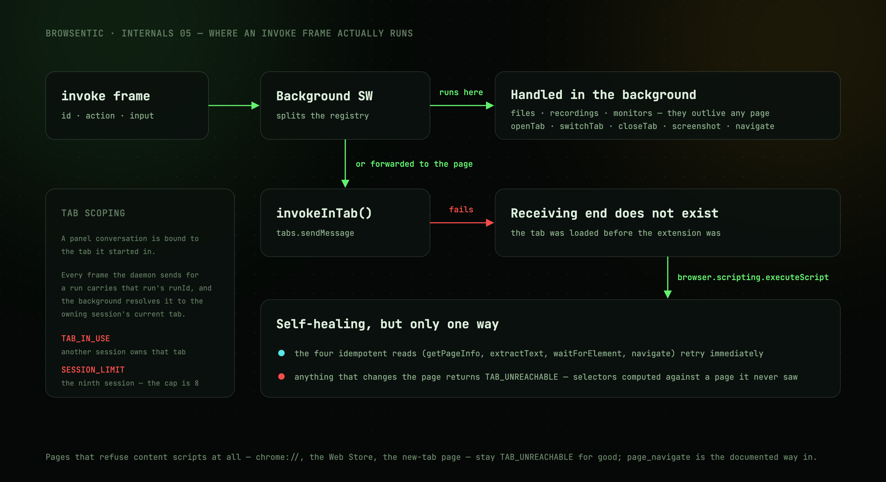

# Inside the extension

Where an invoke frame actually runs, and how a run stays in its own tab.

---

## Background vs content script

Not every capability can run in the page. The background service worker splits them:

| Handled entirely in the background | Why |
| --- | --- |
| `listFiles`, `attachFile`, `listRecordings`, `readRecording` | The data lives in extension storage |
| `startMonitor`, `monitorStatus`, `awaitMonitor`, `stopMonitor` | Monitors outlive any single page |
| `startDiagnostics`, `readConsole`, `readNetwork`, `stopDiagnostics` | The debugger attaches to a tab, and the buffers outlive any single page |
| `openTab`, `switchTab`, `closeTab`, `screenshot`, `navigate` | Need the `tabs`/`scripting` APIs |
| Everything else | Forwarded to the content script |

Nine of those need Chrome's `debugger` API, which Firefox has no counterpart for: `trustedClick`,
the two captcha tools, the four diagnostics tools, `injectCode` and `runCode`. Each is marked
`chromiumOnly` in its module, and `describeActions('firefox')` leaves them out, so a Firefox build
never lists them — the agent there is offered a shorter list, and the daemon knows that list by its
hash and reports it as in sync. The actions themselves stay registered on both builds: a stale
skill that names one is answered with `UNSUPPORTED` and a hint, not `UNKNOWN_ACTION`. The
build-time branch lives in one place, `describeOwnActions()` in `src/lib/bridge/own-actions.ts`;
the registry itself never reads `import.meta.env`, because the daemon bundles it under Node.

## The microphone is granted from a tab

Chromium anchors a permission prompt to a tab. A side panel and a popup have none, so
`getUserMedia` there is refused without ever asking, and no manifest permission grants the
microphone to an extension. `use-speech.ts` therefore reads `navigator.permissions` first: on
`prompt` it never calls `getUserMedia` — repeated silent refusals would earn the origin a temporary
block — and offers **Allow microphone** instead. That opens the unlisted `mic-permission.html`
entrypoint in a tab, where the prompt can appear. The grant belongs to the extension's origin, so the
panel, the popup and hands-free mode's offscreen page all see the `PermissionStatus` change and start
listening without a reload. Firefox prompts from its sidebar on its own and skips the check.

## The Firefox build is signed, and says who it is

`yarn build:firefox` produces a Manifest V2 extension from the same source, and its manifest carries
a `browser_specific_settings.gecko` block the Chrome build has no use for:

- **`id: browsentic@browsentic.com`** — addons.mozilla.org signs nothing without a permanent id,
  and the first signing bound this one to the project's AMO account for good. Changing it would make
  every installed copy a different add-on.
- **`update_url`** — the `updates.json` under the latest GitHub release. Every signed build carries
  this URL, so moving it means every older install stops updating; the release job publishes the
  file next to each signed `.xpi`.
- **`data_collection_permissions: websiteContent`** — Firefox shows this at install. It is the honest
  declaration: what the agent reads on a page leaves the browser for the daemon and reaches the model
  behind whichever agent CLI the user runs.
- **`strict_min_version: 140.0`** — the first Firefox that understands the data-collection key.

Four permissions are filtered out of that build, `sidePanel`, `debugger`, `offscreen` and
`userScripts`: Firefox's Manifest V2 build has no use for any of them, and AMO's validator flags each
name it does not know. The Firefox sidebar is `sidebar_action`, which WXT
derives from the same entrypoint, and the nine tools that need the debugger are left off the list a
Firefox build offers (see [Background vs content script](#background-vs-content-script)).

## Self-healing injection

The forwarding call is `invokeInTab()`. A tab that loaded *before* the extension did has no content
script, so `tabs.sendMessage` fails with `Receiving end does not exist`. The extension then injects
the content script via `browser.scripting.executeScript` and:

- for the four idempotent reads (`getPageInfo`, `extractText`, `waitForElement`, `navigate`) it
  **retries immediately**;
- for anything that *changes* the page it returns `TAB_UNREACHABLE` with instructions to re-snapshot
  first — because the caller's selectors were computed against a page it has not actually seen.

`onInstalled` also sweeps every open, non-discarded tab and injects there, so a fresh install does
not leave you with a browser full of unreachable tabs.

Pages that refuse content scripts at all (`chrome://`, the Web Store, the new-tab page) stay
`TAB_UNREACHABLE` permanently. `page_navigate` still works there through the tabs API, which is why
it is the documented escape hatch.

---

## The panel's tabs

`PanelNav` owns the tab strip: **Chat**, **History**, **Skills**, **Recordings**, **Schedules**.
Adding one is an entry in `PANEL_TABS` (which `PanelTab` is derived from), an entry in `TABS` and
`RAIL_TABS`, and a branch in the side panel's body — there is no router. A stored tab that is no
longer in `PANEL_TABS` — `settings`, from before it moved out — opens on Chat.

**The strip labels as much as it can afford.** A `ResizeObserver` measures the width the labelled
row actually needs and steps through three fits: every label, then only the open tab's, then icons
alone with a dot where the count chip was. A width is only knowable while it is on screen, so each
fit records its own and steps one rung down; stepping back up waits for the width it already
learned, which is what keeps the strip from flapping between two fits at one panel width. In
practice five labels want ~485 px and one wants ~225 px, so a side panel at its usual size lands on
the middle fit.

## The settings page

Settings are not a panel tab. They are the extension's options page, `entrypoints/options/`, which
WXT turns into `options_ui` with `open_in_tab` on both browsers — so it needs no permission, Chrome
lists it as **Options** on the toolbar icon's menu, and Firefox as **Preferences** in about:addons.
The panel's header, the popup's header and the connection sheet open it with
`runtime.openOptionsPage()`, which focuses a settings tab already open rather than adding another.

The page is a sidebar of five sections — **Extension**, **Profile**, **Guardrails**, **Agent**, **Connection** —
with the open one in the URL hash, so a reload or a link lands on it; an unknown hash,
such as the old `#appearance`, lands on **Extension**. **Agent** and **Connection** are the same
`AgentPicker` and `DaemonLink` the popup and the connection sheet show; those keep theirs, so a
blocked run is still one click from its fix.

**Extension** is the theme, then what belongs to this browser alone, in `storage.local`: the
right-click items (`browsentic/contextMenu`), the keyboard shortcuts, and hold to talk
(`browsentic/pushToTalk`, the switch the orb's menu writes too). The shortcuts are the manifest's
`commands`, declared from [shortcuts.ts](../../src/lib/settings/shortcuts.ts) with suggested keys; the
page lists them with `commands.getAll()`, re-read whenever it comes back into view, because the
browser owns the keys and only its own page changes them — `chrome://extensions/shortcuts`
(`edge://` on Edge), or `commands.openShortcutSettings()` on Firefox.

**The theme and Guardrails are shared with the Mac app**, and the daemon keeps both in
`~/.browsentic/config.json`:

- Two bridge ops, `preferences` and `setPreference`, forward to the socket frames of the same name.
  The answer, `preferencesInfo`, is also pushed on connect and after every change to the file,
  whoever made it, and lands in `DaemonState.preferences`. The guardrail section renders that, so a
  row flipped in the Mac app moves here without a reload.
- **The theme stays in `storage.local` too**, because every surface paints from it before any socket
  exists. `servePreferences()` in [preferences.ts](../../src/lib/bridge/preferences.ts) keeps the two in
  step:
  - A push writes the daemon's theme locally.
  - A local pick is sent up, unless it only echoes the push.
  - A pick made while the daemon could not be told sets `browsentic/theme.unsynced`, and wins at the
    next connect. So does a pick made before the browser was ever paired, when config.json names no
    theme yet.

### Themes

A theme is one block of raw tokens in `globals.css` — grounds, inks, lines, the six named colours,
and four dials (`--wash`, `--grain`, `--neon`, `--glow`) that the utilities read instead of naming a
colour themselves. `daylight` sets `--grain` and `--neon` to nothing because film grain and a neon
halo are effects that only exist on black. The semantic tokens the shadcn primitives read are mapped
once, afterwards, from whichever block won, so a theme is that block and no more.

The blocks hang off `[data-theme]` rather than `:root`, and the attribute is **scoped rather than
global**. Put it on a swatch and that subtree renders in the theme it advertises, which is how the
picker draws four live previews with no second copy of the palette. Only raw tokens re-resolve that
way (`bg-ground`, `bg-brand`); the semantic ones (`bg-background`, `border-border`) are computed at
`:root` and inherit, so a scoped preview must not use them.

`browser.storage.local` under `browsentic/theme` is the truth, read by `useTheme()`. It answers a
tick after the page has already painted, though, which on a light theme is a dark flash every time
the popup opens — so `mountTheme()` applies a `localStorage` mirror of the same id synchronously
before React mounts, and lets storage correct it a moment later. `index.html` carries
`data-theme="ember"` and an inline ground so the frame before the stylesheet is neither white nor
unpainted; `applyTheme` clears that inline colour, since an inline colour outranks every rule and
would otherwise pin `<html>` to a dark ground under a light theme.

## Minimizing: the rail lives in the page

**Nothing can resize a side panel.** `chrome.sidePanel` offers `open`, `close`, `setOptions` and
`getLayout`, and `PanelLayout` carries only `side` — the width is the user's, dragged and remembered
by Chrome. So collapsing the panel *into* itself would only leave an empty column. Minimizing
instead **closes the panel and draws a 44 px rail into the page**, which is a surface the extension
can size.

| | |
| --- | --- |
| `src/lib/rail/events.ts` | The channel, the `RailView` the background computes, the tab list with its Lucide paths copied out, and one palette per theme spelled in `oklch` |
| `src/lib/rail/host.ts` | `exposeRail()` in the content script — builds the rail in a **closed** shadow root on `documentElement` |
| `src/lib/bridge/rail.ts` | `serveRail()` and `syncRail()` in the background — what to paint, and when |
| `src/lib/bridge/panel-view.ts` | `browsentic/panelCollapsed` and `browsentic/panelTab`, read by `use-panel-view.ts` in the panel |

The content script carries no React and no icon package, which is why the paths and colours are
copied rather than imported — `src/extension/components/` would drag the whole panel bundle onto every page.

**Which is also why the rail is the one place a theme is spelled twice.** It has no stylesheet to
read `globals.css` from, so `RAIL_PALETTES` and `RAIL_TONES` carry an entry per `[data-theme]`
block, `RailView` carries the id, and `describeRail()` reads `browsentic/theme` alongside everything
else — the same `storage.local.onChanged` listener that repaints the rail on a tab change repaints
it on a theme change.

Both records are `Record<ThemeId, …>`, so a new id that forgets them fails `yarn compile` rather
than stranding an ember rail on every page. The two halves it cannot check are the `[data-theme]`
block itself and the entry in `THEMES` — a theme missing either is a theme the picker offers and
the stylesheet ignores, or the reverse.

**A closed shadow root on `documentElement` is load-bearing.** It keeps the rail out of
`body.innerText` (so `extractText` never returns it), out of the page's `querySelectorAll`, and out
of any page stylesheet. The host element has no layout footprint; the rail inside it is
`position: fixed`, centred on the panel's own side, inset from the edge so it never covers the
page's scrollbar.

**The click is the gesture.** `sidePanel.open()` needs user activation, and the only activation the
panel will ever get is the click on the rail, forwarded from the content script. `serveRail()`
spends it before any `await` — a single statement, no storage read in front of it. It deliberately
does *not* clear the collapsed flag: the panel clears it itself on mount with the `panelOpened`
bridge op, so an `open()` that gets refused leaves the rail on screen rather than dropping the user
into nothing.

**`syncRail()` broadcasts to every tab** instead of tracking which tabs carry a rail. That is a
service-worker decision, not laziness: a `Set` of painted tabs comes back empty when the worker is
revived, which would strand a rail on a page with no way to clear it. The first sync of a worker's
life always broadcasts; only a repeated *clear* is skipped. A tab that has just finished loading is
repainted on its own rather than triggering a broadcast.

**A rail only exists while the panel is minimized on purpose.** The side panel holds a run port
open for as long as it lives, so the background knows the moment the last panel is gone. If the
collapsed flag is not set at that moment — the panel was closed with the browser's own button, not
the collapse button — `clearStrandedRail()` forgets what it thinks tabs are showing and forces the
hide onto all of them, catching any tab an earlier broadcast missed. The content script heals its
own side of the same problem: on injection it removes any rail element left by a previous extension
life, and on a back/forward-cache restore it drops the cached rail and asks the background for the
current state with the rail channel's `sync` op.

The same panel-presence signal drives the context menu, which
[launchers.ts](../../src/lib/bridge/launchers.ts) repaints from scratch — `removeAll`, then one
`create` per item, one paint at a time — whenever the panel opens or closes, hands-free starts or
ends, the settings page switches an item, or the speech service is found missing. **Open Browsentic**
reads **Close Browsentic** while a panel is open, and a click on *Close* shuts it — Firefox's
background closes the sidebar inside the gesture, Chromium panels are told over the run port to
close themselves. **Open Browsentic (Hands Free)** exists only where `handsFreeSupported()` says
speech works, reads **Close Browsentic (Hands Free)** while the orb is up, and toggles
`browsentic/handsFree`, exactly as the panel's detach button and the popup's **Open hands-free** do.
The `toggle-side-panel` and `toggle-hands-free` shortcuts go through the same two toggles; the panel
opens before anything is awaited, because both a menu click and a shortcut hand over a gesture the
first `await` would spend.

Pages that refuse content scripts — `chrome://`, the Web Store, the new-tab page — get no rail.
That is the same `TAB_UNREACHABLE` set as everywhere else, and it is why the toolbar icon and the
**Open/Close Browsentic** context-menu item stay the guaranteed way back in.

## Hands-free: the orb lives in the page

Detaching is the rail's sibling: the panel closes, and a microphone orb is drawn into the page
instead, which the user talks to. The panel cannot be shrunk, so the fold the user sees — the panel
collapsing into a mic that drops away — is `DetachVeil` playing for 560 ms before `closeSidePanel()`,
and the page's orb rising once the page has widened. Firefox closes its sidebar only inside the
click's gesture, so it skips the fold.

| | |
| --- | --- |
| `src/lib/handsfree/events.ts` | The channel, `OrbView`, the orb's requests, the dictation reports, and the Lucide paths |
| `src/lib/handsfree/host.ts` + `styles.ts` | `exposeHandsFree()` — the orb, its arc menu, caption, countdown ring and approval card, in a closed shadow root |
| `src/lib/handsfree/geometry.ts` | Pure layout: which way the arc opens from the edges the orb is against, and which side a caption or card fits on |
| `src/lib/bridge/hands-free.ts` | `serveHandsFree()` — when the microphone listens and for which tab, what every orb shows, and the orb's requests |
| `src/extension/entrypoints/dictation/` | The offscreen page speech recognition runs in, Chromium only |

**Speech needs a document, and the panel is gone.** The background has no DOM, and recognition in a
content script would run on the page's origin — a prompt per site, and none at all where the page's
`Permissions-Policy` forbids the microphone. So recognition runs in an **offscreen document**
(`dictation.html`, reason `USER_MEDIA`) on the extension's own origin, which the `mic-permission`
tab already granted. The document exists exactly while the orb should listen: creating it starts the
mic, closing it stops it, so it needs no command channel of its own. It reports a `DictationPhase`
and each interim and final transcript; the background keeps the phase in `browsentic/dictation` and
relays transcripts to the one tab listening. The phase is only ever what the page itself reported —
the background writes none ahead of it, so the orb never shows a microphone the page has not opened —
except `failed` for a document that could not be created, which then waits for a press on the orb
rather than being retried on every repaint. Only `network` is `no-service`; any other recognizer
error is `failed`, a retry and no verdict on the browser.

**Chrome runs one recognizer at a time**, and a second one aborts the first. That is why the panel
and hands-free never overlap — the panel's `panelOpened` ends hands-free, starting hands-free sends
every connected panel `close`, and the orb does not listen while any panel's run port is connected —
and why an `aborted` the document did not ask for is read
as another page taking the mic. The document then stops as `yielded` rather than restarting into a
tug-of-war; a press on the orb takes the mic back.

**Hands-free only exists where speech does.** `speech-support.ts` decides it in two layers.
`speechCapable()` is what is knowable without listening: a Firefox build (no offscreen documents, no
recognizer), no `offscreen` API, no recognizer constructor, or a brand known to ship the recognizer
without a service behind it (`Brave`, which fails every attempt with `network`). What that lets
through is settled by the service itself: the panel's dictation and the offscreen page record
`browsentic/speechService` in `storage.local` — `works` on the first transcript, `missing` on a
`network` failure, and `works` always wins, since a service that answered once is only out of reach.
The panel hides the detach button and `/hands-free` behind `useHandsFreeSupported()`, which starts
hidden so nothing flashes; `paint()` ends hands-free on the spot if it finds itself on anywhere
unsupported, and a `missing` found mid-session raises a toast saying why the mic left. Note that
Vitest serves `import.meta.env.FIREFOX` as the string `"false"`, which is truthy — the decision
itself is the pure `capableOf()` so it can be tested at all.

**The microphone listens for one tab**: the one in front of a focused window, whose conversation has
no run and no approval waiting, while the link is up and the user has not muted it. Every other orb
is painted `paused`. `paint()` computes each tab's `OrbView`, sends only the ones that changed since
that tab was last told, and records which tabs answered — a tab with no orb is never aimed at. The
tab in front is told afresh until it answers, and gets the content script injected if it has none,
as every open tab does after the extension reloads. The tab the mic is aimed at is asked again once
it finishes loading, so a navigation to a page the content script cannot run in lets go of the mic.
Like the rail it is a cache the worker can lose: a revived worker repaints everything. Only the parts
of `browsentic/tabSessions` an orb shows — which tabs, the run, the approval — and the daemon link's
state trigger a repaint; a run rewrites the rest on every step.

**The orb owns only what dies with the page**: what has been said since the last send, the countdown
ring (`AUTO_SEND_MS`, the composer's 1.6 s), the A-Eye focus, the live-code toggle and the files
attached since the last send. An instruction goes through the same `instruct` the panel's run port
takes, via `runCommand()`, so it lands in the tab's own conversation and takes the fast path as a
typed one would. A finished turn's last reply or error comes back as a `say` caption, through
`onTurnSettled()`, which also fires for a turn that never reached the agent — answered on the fast
path, refused as `SESSION_LIMIT` or `RUN_IN_PROGRESS`, or with no daemon attached — since no panel is
there to show those. An attach answers only once the file belongs to the conversation, via
`attachFile()`.

**Hold to talk swaps the dictation page's mode, not the orb's.** `browsentic/pushToTalk` in
`storage.local` is a preference, so it is remembered. With it on, the background opens
`dictation.html?hold`, which holds no microphone until a `talk` command arrives — `talk: true`
relayed only from the tab being listened for, `talk: false` from any, since the key can come up after
the mic moved on — and on `talk: false` calls `stop()` rather than `abort()`,
so Chrome finishes the words already spoken; anything still interim is reported as final, then the
page says `held`. The orb sends on that `held`, or after 2.5 s, whichever comes first. A page left
in the other mode is closed and opened afresh, which is how the toggle takes effect, and so is a hold
page whenever the mic moves to another tab, so words held down in one never land in another. The
page checks it is still wanted after the permission query, so a release during that query cannot
leave a recognizer running, and an orb removed mid-hold releases the key on its way out.

The key is `event.code === 'ControlLeft'` (`HOLD_KEY_CODE`) — a physical position, so layout-proof,
present on every platform, and inert on its own everywhere. Because Control is a modifier, a hold
engages only after 250 ms with nothing else pressed, and any other key, a pointer press, a wheel, a
window blur or the tab hiding cancels it and discards what was heard. Only trusted events count: a
page that synthesizes a keydown would otherwise be opening the user's microphone. The listeners are
on the top page's window, since the content script runs in no other frame; an orb whose host the page
removed tears its listeners down on the next event instead of answering beside its replacement.

**Approvals are the orb's to show.** The view carries the waiting approval, the orb turns ember, and
a press opens the same Allow / Deny / Always choice as the timeline, placed on whichever side of the
orb it fits and pointing at it. It carries the agent's code whole, scrollable, never cut short,
since Allow runs all of it. An approval in a tab nobody is looking at raises a toast on the page that
is, or an OS notification when the browser is in the background — once, with the announced ids kept
in `browsentic/approvalsAnnounced` so a revived worker does not raise them again.

**A-Eye skips every overlay.** The rail, the toast and the orb carry `data-browsentic-overlay`
(`src/lib/overlay.ts`). A closed shadow root retargets a hit to its host, so the lens sees the host
element under the pointer; it draws no box there and a click there picks nothing, whether the pick
is the user's or the agent's. An orb that starts a pick also hides until the pick is over.

**So does the agent's pointer.** `elementAt()` in `pointer.ts` reads `elementsFromPoint()` past any
overlay, so `assertUncovered` never blames the mic for covering a target and a drag never drops onto
it. A real pointer still lands on whatever is on top, so `trusted-input.ts` marks every overlay host
`inert` for the length of a trusted click or drag — `inert` reaches through the closed shadow root —
and the gesture reaches the page beneath instead of pressing the mic's own stop.

State: `browsentic/handsFree` in `storage.session` (on while present, with `muted` and `since`),
`browsentic/dictation` and `browsentic/approvalsAnnounced` in `storage.session`, and in `storage.local` `browsentic/speechService`,
`browsentic/pushToTalk` and `browsentic/orbPosition` — the orb's centre as viewport fractions, so one drag places it on every tab. Hands-free is session state
on purpose: a restarted browser comes back with the panel, not a live microphone.

## Tab scoping

A panel conversation is **bound to the tab it started in**.

The background keeps a registry of tab sessions in `browser.storage.session` under
`browsentic/tabSessions`. Each entry maps a `sessionId` to:

- its main tab,
- the subtabs its runs opened,
- the tab its next action should land on,
- the live tab title,
- the run currently going in it, if any.

Every frame the daemon sends for an agent run carries that run's `runId`, and the extension resolves
it to the owning session's current tab. So a run keeps working in its own tab while the user browses
somewhere else, and two sessions in two tabs act independently.

| Situation | Behaviour |
| --- | --- |
| A run opens a tab with `page.openTab` | Adopted as a subtab of the same session |
| `page.switchTab` onto a tab another session owns | Refused with `TAB_IN_USE` |
| Every tab of a session is gone | Its actions fail with `SESSION_TAB_CLOSED` |
| A ninth session is opened | `SESSION_LIMIT` — the cap is 8 |

Calls with no run behind them — an external MCP client, the local fast path — still target the
**active tab of the current window**.

A site-mapping run keeps its own older pin, threading a literal `tabId` and failing with
`MAPPING_TAB_CHANGED` if that tab goes away.

### Lifecycle

Closing a tab ends its session: the run is cancelled, the transcript is flushed to history, and the
entry leaves the registry.

Closing the side panel does **not** — the tab is the anchor. While a run is going, its tab carries a
dot on the toolbar badge and on its favicon.

## Scheduled runs

The daemon owns the schedule and the clock (`src/daemon/schedules/`); the extension only runs what it
is handed. A due task arrives as a `runTask` frame, answered like an `invoke`. `startTaskRun` in
`run-port.ts` opens a background tab and tags its session with the task. An instruction then goes
through `startTurn` like the Send button's; a recording replays through `invokeForHarness`, step by
step, handing a failed step to the agent. When the run settles, `finishTask` reports `taskDone`, files
the transcript under `browsentic:taskRuns` instead of History, shows the notice and closes the tab.

The task list reaches the panel the same way the agent state does: the daemon pushes `taskList` on
connect and after every change, and the extension caches it in `browsentic/tasks` so the tab still
renders while the daemon is down.

An approval raised by a scheduled run is drawn as a toast on the page in front, not only in the panel.
Its buttons answer through `answerApproval`, the panel's own path. Only the tab the card was drawn
on can answer, only with `isTrusted` clicks, and none in its first 800 ms. The page can still
restyle the card's host element and lure a click onto it, so the card offers **Allow** and **Deny**
only; **Always on ‹site›** stays in the panel.

`nativeMessaging` is what lets a browser start a daemon that is down. When no port answers,
`giveUp` calls `wakeDaemon`, which asks the browser to run the `com.browsentic.daemon` host that
`browsentic setup` registered. That host runs `ensureDaemon` and exits. `browsentic stop` leaves
`~/.browsentic/stopped` behind, and while it is there the host starts nothing; the next daemon to
start, by any other path, removes it.

## Saved tools that run on every visit

A saved tool keeps its code in `storage.local` under `browsentic/savedTools`, and `autoRun` on its
record says whether it should run by itself. That flag is the truth. `auto-run.ts` mirrors it into
Chrome's `userScripts` API, one registration per tool with the id `browsentic-tool-<id>`, in the
`MAIN` world at `document_idle`. The mirror is brought back into line whenever the list changes
(`storage.local.onChanged`), whenever the worker starts, and on the one-minute `browsentic/autoRun`
alarm. It compares code and match patterns and re-registers only what differs.

The `debugger` path that `/` uses would be wrong here. It shows a bar on every attach, fails with
DevTools open, and would have to be driven on each navigation from the worker. A user script is
injected by the browser itself, is exempt from the page's CSP, and outlives a restart. The cost is
Chrome's own per-extension **Allow User Scripts** switch (Developer mode before Chrome 138), which no
API can flip. Until it is on, `chrome.userScripts` is undefined, and `autoRunReady()` turns that
into the `autoRunReady` flag on the run port's `tools` message. Turning it on raises no event and
does not restart the extension; the API just appears in the running worker. So while the panel
shows a tool waiting on it, the panel sends `listTools` every two seconds, which reconciles first.
The alarm covers a closed panel.

The registration matches the whole host, on any port. Scope is decided inside the page by the rule
`/` applies: the exact origin, then the slug of the first path segment. That keeps it right on
single-page sites. There, arriving at `/watch` is a history entry and not a load, so the script also
listens to the Navigation API's `currententrychange`. It runs the entry point on each arrival into
scope, not on each move within it, once `load` has fired and the DOM has gone 400 ms without a
mutation (3 s at most). The approved code is wrapped the way the installer wraps it, and it is
evaluated once per document.

---

## Next

**[Agent runs →](agent-runs.md)** — Path B, where an instruction becomes a spawned CLI.
