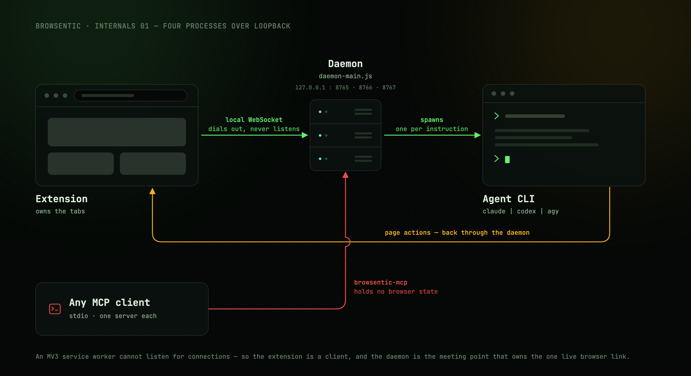

# Overview

Browsentic is a browser harness made of separate parts: the extension in the browser, Browsentic
Bridge (the daemon) on the computer, the agent CLI the daemon spawns to run side-panel
instructions, and the Mac and Windows apps that install and drive the daemon. The parts talk only
over loopback, and the daemon sits in the middle.



---

## Why there is a daemon at all

A Manifest V3 service worker cannot listen for connections. It can only dial out, and the browser
kills and revives it at will. So the extension is a *client*, and the meeting point has to live
outside the browser.

That meeting point is the daemon. It owns exactly one live browser link and fans it out to the side
panel's agent and to any number of external MCP clients:

```
You ──speak or type──> Extension ──local WebSocket──> Daemon ──spawns──> your agent CLI
                            ▲                                        (claude │ codex │ agy)
                            └──────────────── page actions ─────────────────────┘

Any MCP client ──stdio──> browsentic mcp ──> the same daemon ──> the same browser
```

Everything binds to `127.0.0.1`. Nothing listens on a public interface, and there is no cloud
component.

---

## The four processes

| Process | Started by | Lives for | Job |
| --- | --- | --- | --- |
| **Extension** | The browser | As long as the browser runs | Owns the tabs. Runs the side panel, the popup, the background service worker and one content script per page |
| **Daemon** (`daemon-main.js`) | Auto-spawned by the first CLI or MCP client that needs it | Until 30 minutes idle with no extension and no control clients | Owns the browser link, authorization, agent runs, screenshot writes, skill and site-map storage |
| **MCP server** (`browsentic mcp`) | The MCP client, over stdio | The client's session | Translates MCP `tools/call` requests into daemon control frames. One process per client |
| **Agent** (`claude -p` and friends) | The daemon, per side-panel instruction | One instruction | Reasons about the instruction and calls page tools. Contained to Browsentic's own MCP server |

The MCP server is deliberately thin and holds **no browser state**. Killing it leaves the browser
link untouched, because the link belongs to the daemon.

The daemon has no start command: the first CLI or MCP client that needs it spawns it. That is also
why a rebuild alone changes nothing while a daemon is running; see
[Contributing](contributing.md#the-daemon-keeps-the-old-build-in-memory).

The Mac and Windows apps are not on the request path. Each lays down the daemon and the CLI, then
drives the daemon over its control socket: see [The macOS app](mac-app.md) and
[The Windows app](windows-app.md).

---

## The two paths through it

Every request takes one of two paths:

| | |
| --- | --- |
| **[Path A](request-path.md)** | An external MCP client calls a page tool (optional). Thin and unconditional, with no agent on Browsentic's side |
| **[Path B](agent-runs.md)** | You type or speak into the side panel. The instruction goes through the intent funnel, then may spawn an agent CLI that loops back through Path A |

Path B closes back onto Path A. The agent the daemon spawns runs *another* `browsentic mcp`, which
connects back to the same daemon, so an agent run reuses the exact tool surface an external client
gets while being [gated differently](guardrails.md). (Codex's app-server takes the same tools over
its stdin instead; see [Agent runs](agent-runs.md#a-cli-held-over-stdin).)

---

## Next

**[Transport →](transport.md)**: how a client connects in the first place.
