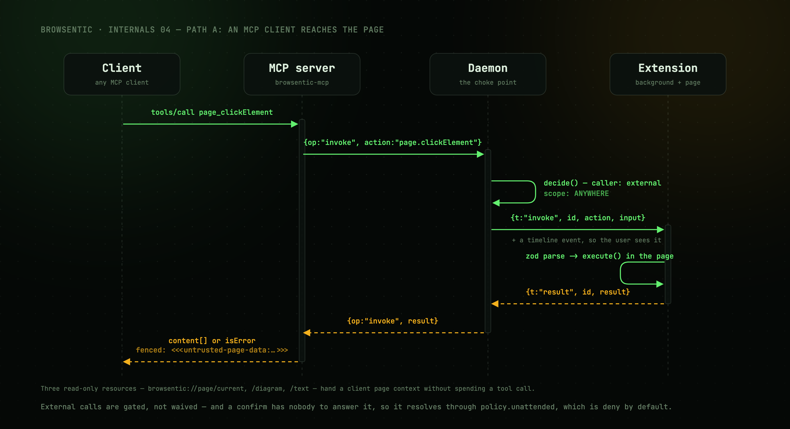
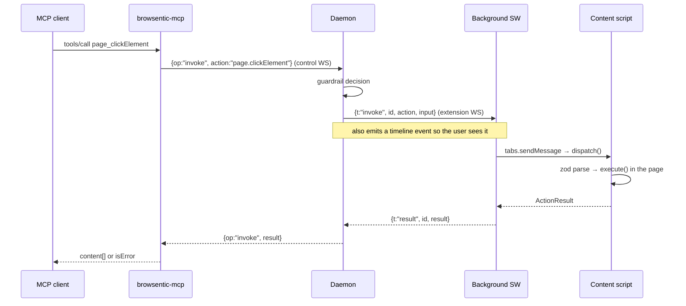

# Path A — an MCP client drives the browser

The unconditional path. No agent on Browsentic's side, no intent funnel.

[The same sequence, animated →](../assets/request-path.gif)

---

---

## Details worth knowing

**`browsentic-mcp` starts the daemon if needed.** `ensureDaemon()` reads the lockfile, checks the
pid is alive and `/health` answers, and otherwise spawns a detached `daemon-main.js`, polling for up
to 8 seconds. It never compares versions, so a running daemon keeps serving an old build until
`browsentic-mcp restart`.

**External calls are visible.** The daemon emits a `tool`/`toolResult` pair tagged
`source: 'external'` on the run channel, so anything an MCP client does appears on the user's
timeline.

**External calls are gated, not waived.** The request is evaluated with `caller: 'external'` and
`scope: ANYWHERE`. Deny rules deny; confirm rules resolve via `policy.unattended`, which is `deny` by
default because there is nobody to ask. See [Guardrails](guardrails.md).

**Results are fenced.** Page-authored text is wrapped with a per-daemon random marker before it
reaches the model. This happens in the MCP server's renderers, so it covers the external path as
well as agent runs.

**Timeouts are per action, not global.** The control request waits 60 s by default; the extension
link allows 120 s for a screenshot, the computed typing duration plus 30 s for `page.typeText`, any
declared `timeoutMs` plus 5 s, and 30 s otherwise.

**Screenshots are persisted by the daemon**, not the browser, and only on request.
`persistScreenshot()` writes nothing unless the call passed `save: true` or a mapping run supplied a
`saveTo` — so the captures an agent takes to look at a page leave no files behind. It reads `save`
off the *raw* input rather than the parsed one, because the zod default is applied in the content
script and never reaches the daemon. When it does write, it decodes the data URL into `screenshotDir`
at mode `0600` and adds `savedTo` to the result. A failed write becomes `saveError` — the capture
still succeeds.

**Three read-only resources** (`browsentic://page/current`, `/diagram`, `/text`) give a client page
context without spending a tool call. They *throw* on failure rather than returning an error result,
because MCP resources have no error channel.

---

## Next

**[Inside the extension →](extension.md)** — what happens after the invoke frame arrives.
