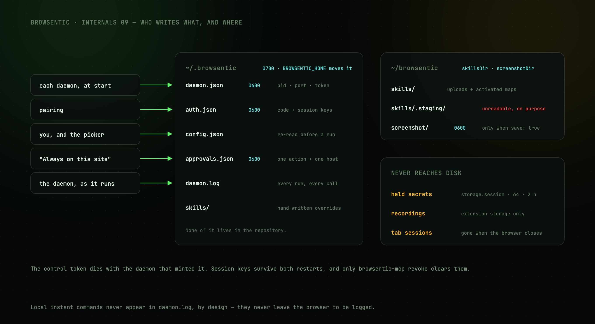

# State on disk

Nothing lives in the repository.



```
~/.browsentic/                 (mode 0700, override with BROWSENTIC_HOME)
├── daemon.json    0600        lockfile: pid, port, control token, protocol + daemon version
├── auth.json      0600        outstanding pairing code, session keys per browser
├── config.json                optional, hand-written
├── approvals.json 0600        "always on this site" grants, one action + host per entry
├── daemon.log                 run starts, routed skills, every tool call and its outcome
├── skills/                    hand-written skill overrides
├── cli/                       macOS app only: the command, the daemon, bundled skills, the extension payload
├── bin/                       macOS app only: the `browsentic` and `browsentic-mcp` launchers
└── runtime/node/              macOS app only, and only when the Mac had no Node 20+: a private copy from nodejs.org

~/browsentic/                  (paths configurable)
├── extension/chrome-mv3/      the unpacked extension `browsentic setup` installs
├── skills/                    panel uploads + activated site maps
│   ├── acme-com/SKILL.md
│   └── .staging/              maps awaiting review — unreadable to the loader
└── screenshot/    0600        captures taken with save: true
```

| File | Written by | Notes |
| --- | --- | --- |
| `daemon.json` | Each daemon at startup | The control token dies with the daemon that minted it. Read it with `browsentic token` |
| `auth.json` | Pairing | Session keys are per browser profile, keyed by its install id, and survive restarts. Cleared by `browsentic revoke` |
| `config.json` | You, and the agent picker | Re-read before every run — no restart needed. [Reference](../guide/configuration.md) |
| `approvals.json` | **Always on ‹host›** | One action + host per entry. Only short-circuits a `confirm` |
| `cli/`, `bin/`, `runtime/` | [Browsentic.app](../guide/mac-app.md) | Replaced whole on every app update. `cli/.browsentic-app.json` is what makes `installKind()` answer `app`, which turns the npm self-update off |
| `daemon.log` | The daemon | `browsentic logs`. Local [instant commands](../guide/features/instant-commands.md) never appear here, by design |

## The one that is not yours

`~/.npm/_npx/<hash>/` is npm's, not Browsentic's, but a machine set up with `npx browsentic setup`
keeps the whole package there — CLI and extension payload both — and npm reuses it without ever
re-checking the registry. It therefore behaves like state: it decides which version you run, it
survives deleting both directories above, and it is why a reinstall could land on a months-old
build. `browsentic update` replaces it; `browsentic uninstall` deletes it.

## The three exceptions

**Held secrets** never reach disk at all. A credential the sanitizer seals out of a page is kept in
the extension's `browser.storage.session` under `browsentic/secrets`, capped at 64 entries, expiring
after two hours and emptied by the browser on restart. The daemon never receives one.

**Recordings** stay in the extension's own storage, not on disk. Removing the extension removes them.

**Tab sessions** live in `browser.storage.session` under `browsentic/tabSessions`, so they are gone
when the browser closes. So do **diagnostics buffers** (`browsentic/diagnostics`), monitors and
timers — none of what a page reported about itself outlives the browser that reported it.

## Relocating

`BROWSENTIC_HOME` moves `~/.browsentic` wholesale. `screenshotDir` and `skillsDir` in config move
those two `~/browsentic` subdirectories independently, and `browsentic setup --dir` installs the
extension somewhere else.

---

## Next

**[Contributing →](contributing.md)**
