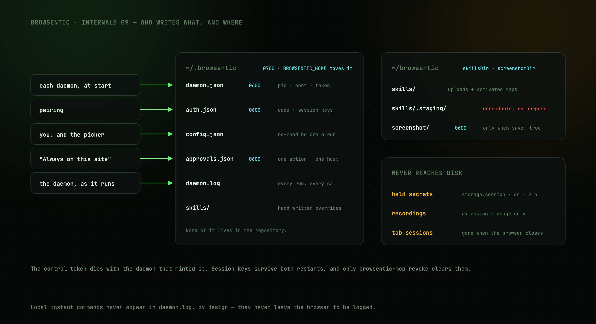

# State on disk

Nothing lives in the repository.



```
~/.browsentic/                 (mode 0700, override with BROWSENTIC_HOME)
├── daemon.json    0600        lockfile: pid, port, control token, protocol + daemon version
├── auth.json      0600        outstanding pairing code, session keys per browser
├── config.json                optional, hand-written
├── profile.json   0600        the settings page's Profile: your details and standing instructions
├── approvals.json 0600        "always on this site" grants, one action + host per entry
├── models.json    0600        each agent CLI's own model list, as last read
├── schedules.json 0600        scheduled tasks and the last twenty runs of each
├── native-host/               the helper a browser launches to start the daemon
├── stopped                    only after `browsentic stop`: the helper leaves the daemon down
├── daemon.log                 run starts, routed skills, every tool call and its outcome
├── skills/                    hand-written skill overrides
├── cli/                       desktop apps only: the command, the daemon, bundled skills, the extension payload
├── bin/                       desktop apps only: the `browsentic` and `browsentic-mcp` launchers (.exe on Windows)
└── runtime/node/              desktop apps only, and only when the computer had no Node 20+: a private copy from nodejs.org

~/browsentic/                  (paths configurable)
├── extension/chrome-mv3/      the unpacked extension `browsentic setup --unpacked` writes, when asked for
├── skills/                    panel uploads + activated site maps
│   ├── acme-com/SKILL.md
│   └── .staging/              maps awaiting review — unreadable to the loader
└── screenshot/    0600        captures taken with save: true
```

| File | Written by | Notes |
| --- | --- | --- |
| `daemon.json` | Each daemon at startup | The control token dies with the daemon that minted it. Read it with `browsentic token` |
| `auth.json` | Pairing | Session keys are per browser profile, keyed by its install id, and survive restarts. Cleared by `browsentic revoke` |
| `config.json` | You, the agent picker, and the settings page and desktop app for `theme` and `guardrails` | Re-read before every run — no restart needed — and watched, so a hand edit reaches every open settings screen. [Reference](../guide/configuration.md) |
| `profile.json` | The settings page's **Profile** section | Only exists while something is filled in: clearing every field deletes it. Re-read before every run and watched like `config.json`; kept apart from it so the config never holds personal details. [Reference](../guide/configuration.md#profile) |
| `approvals.json` | **Always on ‹host›** | One action + host per entry. Only short-circuits a `confirm` |
| `models.json` | The daemon, reading each agent CLI's model list | A cache: deleting it only means the lists are read again. A failed read keeps the last list that read cleanly |
| `schedules.json` | The Schedules tab, `browsentic tasks` | At most 25 tasks. The daemon re-reads it every minute, so an edit from the CLI lands without a restart. Transcripts stay in the extension: the last three runs of each task |
| `native-host/` | `browsentic setup` | A launcher that runs this CLI with the `PATH` setup saw. Each browser gets a manifest in its own `NativeMessagingHosts` folder (a registry key on Windows) naming the extension origins allowed to use it: both store listings always, the unpacked folder, and each paired browser. Pairing adds the new one, and the Bridge rewrites them every time it starts. `browsentic uninstall` removes both |
| `stopped` | `browsentic stop` and `restart` | While it exists the helper starts no daemon, so a paired browser cannot undo a stop. The next daemon to start removes it |
| `cli/`, `bin/`, `runtime/` | The [macOS](../guide/mac-app.md) or [Windows](../guide/windows-app.md) app | Replaced whole on every app update. `cli/.browsentic-app.json` is what makes `installKind()` answer `app`, which turns the npm self-update off |
| `daemon.log` | The daemon | `browsentic logs`. Local [instant commands](../guide/features/instant-commands.md) never appear here, by design |

## The one that is not yours

`~/.npm/_npx/<hash>/` is npm's, not Browsentic's, but a machine set up with `npx browsentic setup`
keeps the whole package there — CLI and extension payload both — and npm reuses it without ever
re-checking the registry. It therefore behaves like state: it decides which version you run, it
survives deleting both directories above, and it is why a reinstall could land on a months-old
build. `browsentic update` replaces it; `browsentic uninstall` deletes it.

## The exceptions

**Held secrets** never reach disk at all. A credential the sanitizer seals out of a page is kept in
the extension's `browser.storage.session` under `browsentic/secrets`, capped at 64 entries, expiring
after two hours and emptied by the browser on restart. The daemon never receives one.

**Recordings** stay in the extension's own storage, not on disk. Removing the extension removes them.

**Saved tools** keep their code in the extension's `storage.local` under `browsentic/savedTools`; the
daemon gets only a markdown note. A tool set to run on every visit is also registered with Chrome as
a user script, rebuilt from that list whenever it changes, so removing a tool removes both.

**Attached files** stay there too: the bytes under `browsentic:file:<id>`, and the index under
`browsentic:files`, where each entry records the conversation it belongs to, the file analyst's
report and the agent session that report was handed to. A conversation's files are deleted when it
leaves history. The daemon holds a copy only while the analyst reads it, in the agent's task
workspace at `0600`, and deletes it when the report is in.

**Tab sessions** live in `browser.storage.session` under `browsentic/tabSessions`, so they are gone
when the browser closes. So does **hands-free mode** (`browsentic/handsFree`, the listening
state under `browsentic/dictation`, and the approvals it has already announced under
`browsentic/approvalsAnnounced`) — a restarted browser never comes back with a microphone on.
Only where the orb was dragged to (`browsentic/orbPosition`), whether hold-to-talk is on
(`browsentic/pushToTalk`) and whether this browser's speech service has ever worked
(`browsentic/speechService`) are kept in `storage.local`, along with which right-click items this
browser shows (`browsentic/contextMenu`, both on when absent).

**Blocked sites** are `browsentic/blockedSites` in `storage.local` — a list of patterns, up to 500, that
the daemon never receives. Removing the extension removes it; each browser keeps its own.

**The star request** is `browsentic/starNudge` in `storage.local`: whether its star was clicked, how
many times it was closed and in which conversation, and up to four conversation ids counted since.
It never leaves the browser.

**The theme** is config.json's `theme`, mirrored into `storage.local` under `browsentic/theme` so a
page paints before any socket is up. `browsentic/theme.unsynced` marks a pick the daemon has not heard
yet, handed over at the next connect. So do **diagnostics buffers** (`browsentic/diagnostics`), monitors and
timers — none of what a page reported about itself outlives the browser that reported it.

## Relocating

`BROWSENTIC_HOME` moves `~/.browsentic` wholesale. `screenshotDir` and `skillsDir` in config move
those two `~/browsentic` subdirectories independently, and `browsentic setup --unpacked --dir` installs the
extension somewhere else.

---

## Next

**[Contributing →](contributing.md)**
