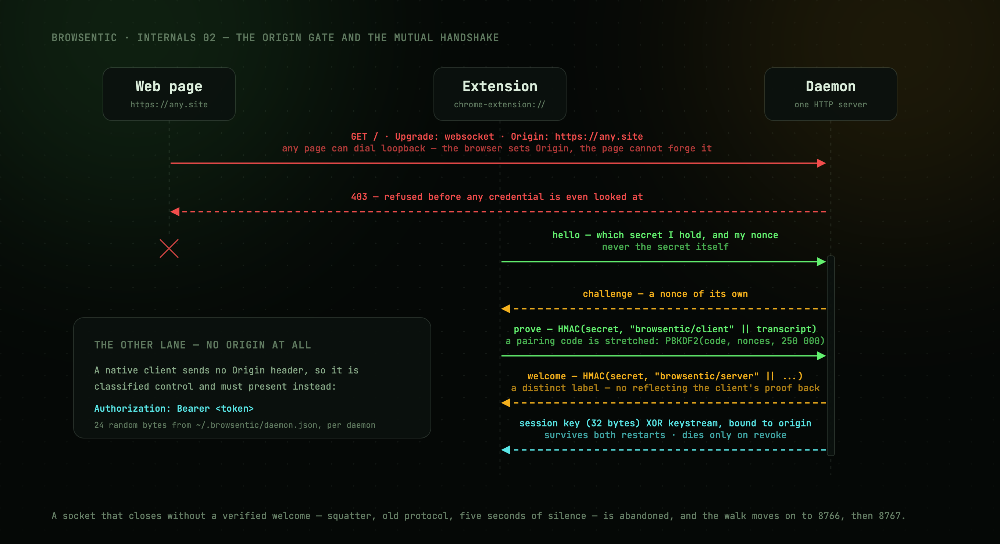

# Transport and authorization

How the extension and local clients (the CLI, MCP servers, the desktop apps) connect to the daemon
over loopback, and how each side proves it is allowed to.

[The same sequence, animated →](../assets/transport.gif)

---

## One server, three ports

The daemon runs one HTTP server that answers `GET /health` and upgrades everything else to a
WebSocket. It binds the first free port of **8765, 8766, 8767**. If all three are taken it will not
start.

`BROWSENTIC_PORTS` replaces that list for the daemon and the CLI: comma-separated, with `0` for
whatever port the OS hands out. The test suite sets it so a test daemon never takes a port from the
one you are running. The extension cannot read it and always walks the three, so no browser will find
a daemon moved off them.

---

## The origin gate

Every upgrade is classified by the handshake `Origin` header before anything else happens:

| `Origin` | Role | Requirement |
| --- | --- | --- |
| `chrome-extension://…`, `moz-extension://…`, `safari-web-extension://…` | `extension` | Proof of a pairing code, or of the session key minted for that browser's install id |
| Any other value | (none) | **Refused.** This is what keeps web pages out |
| Absent | `control` | `Authorization: Bearer <token>` matching the lockfile, compared with `timingSafeEqual` |

Every request, `/health` included, must also carry a loopback `Host`. A page whose own DNS points at
`127.0.0.1` still arrives with the attacker's hostname, so **DNS rebinding gets a 403 before the
`Origin` check even runs**.

The split matters because any web page can open a WebSocket to loopback. Browsers set `Origin`
themselves and page JavaScript cannot forge it, so a page reaching the daemon is classified as a web
origin and rejected outright. Native clients send no `Origin`, so they land in the control lane,
which requires a token they could only have read off the local filesystem.

So there are two independent gates: **the origin says what kind of peer this is, and the credential
says whether this particular peer is allowed.**

---

## The control token

24 random bytes, base64url, minted fresh by **each** daemon and written to
`~/.browsentic/daemon.json` at mode `0600`. It dies with the daemon that issued it, so a token that
leaked once does not open every future daemon.

Clients re-read the lockfile before every connection, and `probeExisting()` matches the pid in
`/health` against the lockfile so it never offers a token to a daemon that never issued it.

Read it with `browsentic token`.

---

## Pairing and sessions

The extension connects to nothing until you pair it.

1. `browsentic pair` asks the daemon for a code: 8 characters from an alphabet with the
   ambiguous glyphs removed, valid **10 minutes**, single use.
2. You paste it into the popup. The extension dials `ws://127.0.0.1:<port>/extension`, walking the
   three ports, and sends `hello`, which names *which* secret it holds and carries a fresh nonce,
   never the secret itself.
3. The daemon answers `challenge` with a nonce of its own. Both sides now share a transcript: the
   protocol version the `hello` claimed, the extension version, the manifest hash, and the two
   nonces. The manifest hash names the tool list this build offers: a Chromium build's, or a Firefox
   build's, which leaves off the nine tools that need Chrome's debugger. The daemon knows both lists
   and serves the one the hash names; an unknown hash is a drifted build, which is asked for its list
   and served that. Either way the list belongs to that browser alone: a run is offered its own
   browser's tools, and a caller outside any run is offered those of the browser its next call would
   reach.
4. The extension replies `prove` with `HMAC(secret, "browsentic/client" ‖ transcript)`. For a
   pairing code the key is not the code but `PBKDF2(code, nonces, 250 000)`, so recording one
   handshake does not let anyone grind an 8-character code offline.
5. The daemon verifies, then proves *itself*: `welcome` carries
   `HMAC(secret, "browsentic/server" ‖ transcript ‖ the rest of the welcome)`. The two labels are
   distinct, so an impostor cannot reflect the extension's own proof back at it.
6. On pairing, the daemon mints a **session key** (32 random bytes) bound to the **install id** the
   `hello` carried: a UUID the extension mints once per browser profile. The origin cannot name a
   browser, because every browser installing from the same store, or loading the same unpacked
   folder, presents the same one. A session paired before install ids existed is found by its
   origin and claimed by whichever browser proves its key. The daemon returns the key XORed with a
   keystream derived from the same secret, so the long-lived credential never crosses the wire in
   the clear. It survives browser and daemon restarts and dies only when you `browsentic revoke`.

### Why the daemon proves itself too

The three ports are well known and any local process can bind one first, so an extension that
trusted whatever answered could be driven by a squatter.

So a socket that closes without a **verified** `welcome` (a squatter, a daemon from an older
protocol, an `unauthorized` frame, five seconds of silence) is abandoned, and the walk moves to the
next port. Only a peer that proves it holds the same secret ever gets to send an `invoke`.

### Reconnection

Exponential backoff from 1 s to 30 s with jitter, plus a one-minute `browser.alarms` tick that
re-dials if the service worker was torn down in between.

A rejected `hello` comes back as an `unauthorized` frame carrying a `retryable` flag. Nothing has
proved itself at that point, so the extension treats it as a **claim rather than a verdict**: it
notes the reason, tries the remaining ports, and if none work it reports the error and stops
dialling. It never deletes the stored key; only pairing again or `disconnect` replaces it.

---

## Protocol version

Both sides compile in `SOCKET_PROTOCOL_VERSION` (currently **23**). They used to have to match
exactly. A store copy updates when its browser decides to, not when the daemon does, so the
extension and the daemon are routinely a version apart, and the daemon accepts a **window**:

- It lets in any extension whose `hello` claims `MIN_EXTENSION_PROTOCOL` (22) or more, newer than
  itself included, and builds the transcript from the number the `hello` claimed, so the proofs
  verify across versions. Older ones are refused with `protocol version mismatch: …`, the words an
  extension before 0.8 already reads as a refusal not worth retrying.
- A `hello` may carry `minDaemonProtocol`, the oldest daemon that extension works with. A daemon
  below it refuses with `daemon too old: …`.
- `welcome` carries the daemon's own `protocolVersion`, so a newer extension knows what not to
  send. A `welcome` without one comes from a daemon before 0.8, which speaks 22 or less.

**The rule for changing it.** A change a peer can do without (a new frame, a new optional field)
bumps `SOCKET_PROTOCOL_VERSION`, and the new frame is sent only to a peer whose `hello` (or
`welcome`) says it speaks that number. Anything the daemon does not know, it leaves unanswered. Only
a change neither side can do without raises a minimum. A refusal must never strand a browser: the
v0.8.0 store build unpairs on any refusal and does not retry, so no daemon may refuse protocol 22
until a store build that retries has replaced it.

### Protocol 23: Android

Protocol 23 adds the frames that let a browser drive Chrome on an Android phone through the Bridge.
The Bridge keeps the number each extension's `hello` claimed and sends these frames only to an
extension that speaks 23. The extension keeps the number the `welcome` carried (`daemonSpeaks`) and
sends them only to a Bridge that speaks 23. An extension that speaks 22 is never sent one, and a
phone request from it is answered `UNSUPPORTED`. The shapes are in `src/lib/phone/types.ts`.

| Frame | From | What it carries |
| --- | --- | --- |
| `androidInfo` | Bridge | The phones and whether one is ready (`AndroidState`). Pushed with an empty `id` on connect and on every change, and the answer to `phoneLaunch` |
| `phoneOpen` | extension | `serial`: start a session with Chrome on that phone. Answered by `phoneOpened` |
| `phoneOpened` | Bridge | The device, its open tabs and Chrome's version, or an error |
| `phoneClose` | extension | `serial`: end the session. Not answered |
| `phoneLaunch` | extension | `serial` and an optional `url`: open Chrome on the phone |
| `cdp` | extension | One DevTools command for the phone's Chrome: `method`, `params`, `sessionId`, and `timeoutMs` (at most 180 s) when the command waits inside the page. Answered by `cdpResult` |
| `cdpResult` | Bridge | Chrome's result, or `CDP_ERROR`, `TIMEOUT`, `PHONE_GONE` or `NOT_OWNER` |
| `cdpEvent` | Bridge | Every DevTools event from the phone, screencast frames included, sent only to the extension that opened the session. A screencast frame that finds the socket more than 4 MB behind is dropped and acknowledged to the phone, so the stream keeps going |
| `phoneClosed` | Bridge | `serial` and why the session ended: `unplugged`, `chrome-exited`, `bridge-stopping` or `closed` |

The Bridge looks for phones only while someone is watching: an extension that speaks 23, or an app
showing its Android tab. The control socket has an `android` op that reads the same state,
subscribes to `android-changed` with `watch` (and lets go with `watch: false`), answers only what is
already known with `peek` (`NOT_CHECKED` while nobody watches), and opens Chrome on a phone with
`launch` and an optional `url` (refused to an agent run's connection). It has no way to send a
DevTools command. Every action on the phone goes through the extension, which is where the
blocked-sites list is checked. [Android phones](android.md) follows a tap through all of it.

---

## What this does not protect against

Pairing controls **which browser**, not which local process. Anything running as your user can read
the lockfile and drive an already-paired browser through the control port. Browsentic assumes your
user account is the trust boundary (see [guide/limits.md](../guide/limits.md#pairing-controls-which-browser-not-which-process)).

---

## Next

**[The action registry →](registry.md)**: what can be sent once a connection exists.
